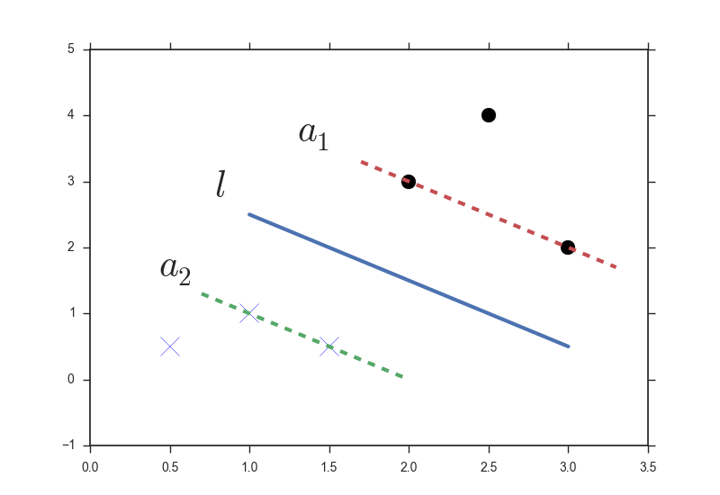
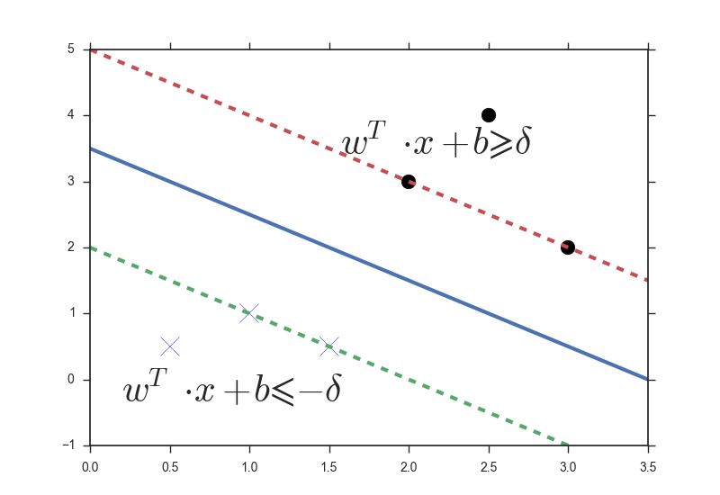
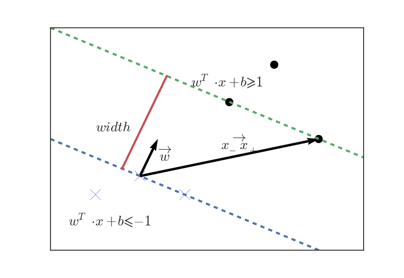

# SVM

[TOC]

SVM: Support Vector Machine，支持向量機

## Python 範例

```python
import pandas as pd 
import numpy as np 
import matplotlib.pyplot as plt
import seaborn as sns

from sklearn import datasets
from sklearn.model_selection import train_test_split
from sklearn.preprocessing import StandarScaler
from sklearn.svm import SVC

# Load data
iris = datasets.load_iris()
X_train, X_test, y_train, y_test = train_test_split(iris_data[['sepal length (cm)', 'petal length (cm) ']], iris_data[['terget']], test_size=0.3, random_state=0)

# Preprocessing
sc = Scancardscaler()
sc.fit(X_train)
X_train_std = sc.transform(X_train)
X_test_std = sc.transtorm(X_test)

# Modeling
svm = SVC(kernel='linear', probability=True)
svm.fit(X_train_std, y_train['target'].values)

# Predict
svm.predict(X_test_std)

# Plot
plot_decision_regions (X_train_std, y_train['target'].values, classifier=svm)
plt.xlabel('sepal length [standardized]')
pit.ylabel('petal width [standardized]')
plt.legend(loc='upper left') 
plt.tight_layout( )
plt.show()
```

- 優點
  - 
- 缺點
  - 資料量越大效能越差

## 超參數

### Kernel Function*

- `linear` linear（線性）
- `poly` Polynomial（多項式）
- `sigmoid` Sigmoid
- `rbf` Radial Basis Function（高斯）（默認）

### C*

懲罰係數(?)，分錯樣本時的懲罰，與決策邊界(Margin)成正比；因此設定越低，模型的容忍度越高；在非線性的差異表現尤其明顯

```python
import numpy as np
import pandas as pd

import matplotlib.pyplot as plt

from sklearn.svm import SVC
from sklearn.datasets import make_classification

X, y = make_classification(n_samples=200, n_features=2,
n_informative=2, n_redundant=0, n_repeated=0, n_classes=2,random_state=42)

#線性kernel分類
clf = SVC(C=0.1, kernel='linear').fit(X, y)
#非線性kernel分類
#clf = SVC(C=1, kernel='rbf', gamma=0.01).fit(X, y)

plt.figure(figsize=(10,6))
plt.title("Linear kernel with C=0.1", fontsize=18)
#plt.title("Predictions of RBF kernel with C=1 and Gamma=0.01", fontsize=18)
plt.scatter(X[:, 0], X[:, 1], c=y, s=50, cmap='cool')
plot_svc_decision_function(clf)

```

### Gamma*

`kernel=('poly', 'rbf', 'sigmoid')` 係數（`1/n_feature`）

有點像是 **判斷是不是同一群** 的調整參數。數值越低，半徑越大，納入更多樣本點在一起；反之，若設定值越大，越有可能遇到過擬合。

```python
#資料點呈前例
#可嘗試調整gamma觀察分類線結果
clf = SVC(C=1, kernel='rbf', gamma=0.01).fit(X, y)
y_pred = clf.predict(X)

plt.figure(figsize=(10,6))
plt.title("Predictions of RBF kernel with C=1 and Gamma=0.01", fontsize=18)
plt.scatter(X[:, 0], X[:, 1], c=y_pred, s=50, cmap='cool')
plot_svc_decision_function(clf)
```

> 線性kernel只需優化 `C`，而非線性kernel記得同時優化 `C`和 `gamma`。`gamma` 很大則 `C` 的影響可忽略不計；`gamma` 小則 `C` 的調整相當於不看 `gamma` 的線性kernel，典型的調整範圍：
>
> - 0.0001 < `gamma` < 10
> - 0.1 < `C` < 100

### Degree

跟 `kernel='poly'` 連動，決定最高次冪級數

### Shrinking


### Maximum Iteration、Tolerence、Cache Size

最大迭代次數、誤差（收斂）容忍度、指定內存數量(MB)


## Idea

找到兩邊距離分類線 $l$，使得Ｍargin（紅、綠兩虛線與 $l$ 的距離）最大



### 數學理論(線性)

令分類線 $l ：W^T \cdot x + b = 0$ ，則
$
\begin{equation}
\begin{split}
a_1 &= W^T \cdot x + b \ge \delta \\
a_2 &= W^T \cdot x + b \le - \delta
\end{split}
\end{equation}
$


同時令
$
\begin{equation}
y^{(i)} = \left\{
\begin{array}{rr}
1, & x^{(i)}=O\\
-1, & x^{(i)}=X
\end{array}
\right.
\end{equation}
$



則 $a_1$ 、 $a_2$ 區域可以表示成 Condition1
$
\begin{equation}
y^{(i)}(W^T \cdot x + b) \ge \delta
\end{equation}
$


接著從兩邊各取一點（即**支持向量機**） $\vec{x_\text{x}}$、 $\vec{x_\text{Ｏ}}$ ，找出想要的Margin Width(上圖中的紅線長度)；即透過 $\overrightarrow{\vec{x_\text{x}} - \vec{x_\text{Ｏ}}}$ 的垂直於方向 $l$ 方向的投影得到長度
$
\begin{equation}
\begin{split}
2 * \text{Margin} & = \frac{\vec{w} \cdot (\vec{x_\text{x}} - \vec{x_\text{Ｏ}})}{\lVert \vec{w} \lVert}\\
 & = \frac{1}{\lVert \vec{w} \lVert} \cdot (\vec{w} \cdot \vec{x_\text{x}} - \vec{w} \cdot \vec{x_\text{Ｏ}})\\
 & = \frac{1}{\lVert \vec{w} \lVert} \cdot (-b-\delta - (-b+\delta))\\
 & = \frac{1}{\lVert \vec{w} \lVert}
\end{split}
\end{equation}
$
因預期使得 Margin越寬越好（兩類分得越開），因此希望 $\lVert \vec{w} \lVert$ 越小越好。結合限制式 Condition1 ，透過 [**Lagrange Multiplier Method & Karush-Kuhn-Tucker (KKT) Conditions**](https://engineering.purdue.edu/ME697Y/KKT.pdf) 方法可以得到最佳解。做法：

令 Condition2
$
\begin{equation}
\alpha_{i} = \left\{
\begin{array}{rr}
0, & y^{(i)}(W^T \cdot x^{(i)} + b) \ge \delta \\
\ge 0, & y^{(i)}(W^T \cdot x^{(i)} + b) = \delta
\end{array} 
\right.
\end{equation}
$

Lagrange 表達式
$
\begin{equation}
\begin{split}
min\ \mathcal{L} = \frac{1}{\lVert \vec{w} \lVert} - \sum^{m}_{i=1} \alpha_i[y^{(i)}(W^T \cdot x^{(i)} + b) - \delta] \\
\sum_{i=1}^{m} \alpha_i[y^{(i)}(W^T \cdot x^{(i)} + b) - \delta] = 0
\end{split}
\end{equation}
$
接著對 $b$、 $w$ 求偏導數
$
\begin{equation}
\begin{split}
\frac{\partial \mathcal{L}}{\partial b} &= - \sum^{m}_{i=1} \alpha_i y^{(i)} \\
\frac{\partial \mathcal{L}}{\partial w} &= w - \sum^{m}_{i=1} \alpha_i y^{(i)} x^{(i)}
\end{split}
\end{equation}
$
令兩式等於 $0$ ，則可得到
$
\begin{equation}
\begin{split}
 & \sum^{m}_{i=1} \alpha_i y^{(i)} = 0 \\
w =& \sum^{m}_{i=1} \alpha_i y^{(i)} x^{(i)}
\end{split}
\end{equation}
$
因 $\alpha_i$ 只有在 $y^{(i)}(W^T \cdot x^{(i)} + b) = \delta$ 的時候才會非 $0$ （如 Condition2 所示），意即 $w$ 會依賴邊界上的點；換句話說是在邊界上的向量 $\vec{x}$ 支撐分界線，這些向量也就被稱為支持向量。

## Reference

- [https://zhuanlan.zhihu.com/p/22400898](https://zhuanlan.zhihu.com/p/22400898)

- [[Day 11] 核模型 - 支持向量機 (SVM)](https://ithelp.ithome.com.tw/articles/10270447)

  ​	[Github範例程式碼](https://github.com/andy6804tw/2021-13th-ironman)
