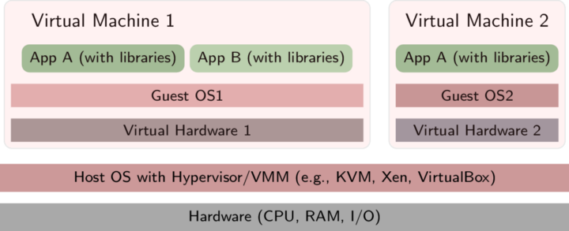

# Docker 簡易操作

[TOC]


## 基本介紹

### 映像檔 Image

> 想像成一個**唯讀**的模板，裏面準備好對應需求的環境設定或是系統。

### 容器 Container

> 透過 Image 所建立的執行實例，通常會有 **啟動**、**開始**、**停止**、**刪除** 等動作，容器之間不互相干擾。

注意到 Image 是唯讀的，容器在啟動的時候建立一層可寫層作為最上層。

#### V.S. Virtual Machine

虛擬機是透過在 Host OS 上面再裝一個作業系統（Guest OS），然後讓兩個作業系統彼此不會打架的平台，架構如下圖。常見的資源如 Virtual Box。



而 Container 是直接將一個應用程式所需的程式碼、函式庫打包，**建立資源控管機制隔離各個容器**，並分配 Host OS 上的系統資源。透過容器，應用程式不需要再另外安裝 Guest OS 也可以執行，架構如下圖所示。


圖片來源：https://gitlab.com/oer/figures/-/tree/master/OS

### 倉庫 Repository

> Image 集中存放的場所，裡面放著別人完成的 Image。

官方提供的公開倉庫註冊伺服器是 [Docker Hub](https://hub.docker.com/) ，大陸的公開資源則是 [Docker Pool](http://www.dockerpool.com/) ，使用者也可以建立自己的 Repository。其使用概念類似 Git，將製作好的 Image push 上去，在本地端只需要進行pull的動作就好。

### Volume

> 可以跨 container 使用的資源。

每個 container 都是獨立且封閉的，若不想要透過進入 container 就能改變內部的程式碼，或者是想要進行 database 升級並保留原本資料，這時就需要 docker volume。

Volume、Bind mount、tmpfs mount 差異比較：

- Volume: Container 將 Volume 存放在 Docker area
- BindMount: 可以為主機裡任何路徑
- tmpfsMount: 主機的 memory


圖片來源：[官網](https://docs.docker.com/storage/volumes/)

[其他詳見](https://philipzheng.gitbook.io/docker_practice/data_management)

### 安裝

直接透過 [官網](https://docs.docker.com/desktop/install/mac-install/) 的說明進行即可。


## 動作

> 底下有出現的指令皆在 MacOS 環境中執行。

### Image 相關

#### 取得 Image

最簡單的管道是 [Docker Hub](https://hub.docker.com/) ，也可以連接到私人倉庫取得。下面的動作表示從預設倉庫(Docker Hub) 拉取(pull) **Ubuntu** ，並且標記為 **22.04**

```
% docker pull ubuntu:22.04
```

#### 列出已知 Image 清單

```
% docker images
REPOSITORY   TAG       IMAGE ID       CREATED       SIZE
ubuntu       22.04     3c2df5585507   2 weeks ago   69.2MB
```

欄位意義：

| REPOSITORY                      | TAG              | IMAGE ID            | CREATED      | VIRTUAL SIZE   |
| ------------------------------- | ---------------- | ------------------- | ------------ | -------------- |
| **來自於哪個倉庫，比如 ubuntu** | **映像檔的標記** | **`ID` 號（唯一）** | **建立時間** | **映像檔大小** |

**TAG** 沒有指定預設為 `latest` ，不過常會使用版本號來做區分，例如 Ubuntu 本身就有很多版本號 `10.04`、`12.04`、`12.10`、`13.04`、`14.04`、`22.04` ... 等等。

#### 建立一個 Image

##### 從 Docker Hub 直接拉取

這個動作與 `docker pull ubuntu:22.04` 同樣都會建立 Image，執行後會立即啟動一個 Container。

```
% docker run --name JerryDocker -t -i ubuntu:22.04
root@835283f29768:/#
root@835283f29768:/# apt-get update
root@835283f29768:/# apt-get install sudo
root@835283f29768:/# exit
```

##### 變更後重新提交新的副本

變更內容 (以簡單安裝動作為例) 後離開 Container ，接著可以透過 `docker commit` 提交變更後的副本，成為另一個新的 Image。成功則會印出新的 Image 的 **`ID`** 。

```
% docker commit -m "install sudo" -a "Jerry" 835283f29768 test:JerryDocker
sha256:ad4fbed3d7a30239b9471acc027984f169c4cba5b58f254caa998ae86532c6b0
% docker images
REPOSITORY   TAG       IMAGE ID       CREATED              SIZE
test         JerryDocker   ad4fbed3d7a3   18 seconds ago   109MB	<-----
ubuntu       22.04         3c2df5585507   2 weeks ago      69.2MB
```

##### 利用 Dockerfile 建立 Image

範例 (此內容建立出來的 Image 與上方範例一摸一樣)：

```
# Comment
From ubuntu:22.04
MAINTAINER Docker Jerry <test@gmail.com>
RUN apt-get update
RUN apt-get install sudo
```

Dockerfile 基本的語法是

- 使用`#`來註釋
- `FROM` 指令告訴 Docker 使用哪個映像檔作為基底
- 接著是維護者的信息
- `RUN`開頭的指令會在建立中執行，這邊使用 apt-get 來安裝了一些套件

```
% docker build - < Dockerfile -t 'test2:JerryDocker'
[+] Building 13.2s (7/7) FINISHED                                                                                                                       
 => [internal] load build definition from Dockerfile
 => => transferring dockerfile: 191B
 => [internal] load .dockerignore
 => => transferring context: 2B
 => [internal] load metadata for docker.io/library/ubuntu:22.04
 => [1/3] FROM docker.io/library/ubuntu:22.04
 => [2/3] RUN apt-get update
 => [3/3] RUN apt-get install sudo
 => exporting to image
 => => exporting layers
 => => writing image sha256:4fdf18202b0885bf4c83d3d3c77144eb1454c1c2deafa49e80ff85852ca9980b
 => => naming to docker.io/library/test2:JerryDocker 
% docker images
REPOSITORY   TAG           IMAGE ID       CREATED          SIZE
test2        JerryDocker   4fdf18202b08   4 minutes ago    109MB	<-----
test         JerryDocker   ad4fbed3d7a3   11 minutes ago   109MB
ubuntu       22.04         3c2df5585507   2 weeks ago      69.2MB
```

可以看到每一個動作都是在 Dockerfile當中所定義好的，完成後同樣會印出新的 Image 的 **`ID`** 。

另外可以用 `docker tag [ID] [name:tag]` 複製出一個 **相同 `ID`** 的 Image。

```
% docker tag 4fdf18202b08 test2:JerryDocker2
% docker images                             
REPOSITORY   TAG            IMAGE ID       CREATED          SIZE
test2        JerryDocker    4fdf18202b08   10 minutes ago   109MB
test2        JerryDocker2   4fdf18202b08   10 minutes ago   109MB	<-----
test         JerryDocker    ad4fbed3d7a3   18 minutes ago   109MB
ubuntu       22.04          3c2df5585507   2 weeks ago      69.2MB
```

##### 從檔案建立

詳見 [docker import](https://docs.docker.com/engine/reference/commandline/import/) 。

#### 匯出與載入 Image

##### 匯出

```
% docker save -o test2.tar test2:JerryDocker2
```

##### 載入

```
% docker load --input test2.tar
```

#### 移除 Image

以下幾種方式都可以：

- `docker rmi [name:tag]`
- `docker rmi [ID]`

**NOTE**: 若 `ID` 有對應到多個 `name:tag` ，可以加上 `-f` 強制將同一個 `ID` 全部刪除；或是手動針對 `name:tag` 刪除。

[更多請看這裡](https://docs.docker.com/engine/reference/commandline/rmi/)


### Container 相關

#### 用 Image 建立 Container （啟動）

- 建立但尚未啟動：

```
% docker run --name test ubuntu:22.04 
```

- 建立然後啟動：

```
% docker run --name test ubuntu:22.04 /bin/bash
```

**NOTE**: `-t` 選項讓Docker分配一個虛擬終端（pseudo-tty）並綁定到容器的標準輸入上， `-i` 則讓容器的標準輸入保持打開。

當利用 `docker run` 來建立容器時，Docker 在後臺執行的標準操作包括：

- 檢查本地是否存在指定的映像檔，不存在就從公有倉庫下載
- 利用映像檔建立並啟動一個容器
- 分配一個檔案系統，並在唯讀的映像檔層外面掛載一層可讀寫層
- 從宿主主機設定的網路橋界面中橋接一個虛擬埠到容器中去
- 從位址池中設定一個 ip 位址給容器
- 執行使用者指定的應用程式
- 執行完畢後容器被終止

##### 啟動已終止的 Container

`docker start [ID]` 或是 `docker start [name]`

#### 後台執行（守護態執行）

```
% docker run --name JerryDaemon -d ubuntu:22.04 /bin/sh -c "while true; do echo hello world; sleep 5; done"
```

#### 列出

```
% docker ps
CONTAINER ID   IMAGE          COMMAND                  CREATED          STATUS          PORTS     NAMES
bca91138b5bc   ubuntu:22.04   "/bin/sh -c 'while t…"   48 seconds ago   Up 47 seconds             JerryDaemon
```

#### 終止

```
% docker stop [ID]
```

##### 重新啟動

```
% docker restart [ID]
```

#### 進入容器

##### `docker exec`

進入 Container 環境當中

```
% docker exec -it [ID] bash
```

##### `docker attach`

進入到當前畫面（若是從多處 attach ，則所有視窗內容皆會同步，會相互干擾）

```
% docker attach [ID]
```

#### 匯出與載入 Container

##### 匯出

```
% docker export [ID] > [filename]
```

##### 載入

直接將 Container 載入成為一個 Image

```
% cat [filename] | docker import - [name:tag]
```

用 `docker import --help` 看更多

#### 刪除

```
% docker rm [ID or name]
```

#### 更多關於 `docker run`

請參閱 [官網](https://docs.docker.com/engine/reference/commandline/run/)

### Hub 相關

#### 查詢官方 Hub

```
% docker search ubuntu
NAME                             DESCRIPTION                                     STARS     OFFICIAL   AUTOMATED
ubuntu                           Ubuntu is a Debian-based Linux operating sys…   15263     [OK]       
websphere-liberty                WebSphere Liberty multi-architecture images …   290       [OK]       
ubuntu-upstart                   DEPRECATED, as is Upstart (find other proces…   112       [OK]       
...
```

可以加上 `-s *N` 來篩選星數的資源 (`*N` 替換成數字)

#### 私有 Hub

[詳見](https://philipzheng.gitbook.io/docker_practice/repository/local_repo)


## 閱讀資源

- [《Docker —— 從入門到實踐­》正體中文版](https://philipzheng.gitbook.io/docker_practice/)
- [Docker 基礎教學與介紹 101](https://cwhu.medium.com/docker-tutorial-101-c3808b899ac6)
- [官方網站](https://docs.docker.com/engine/reference/run/)
