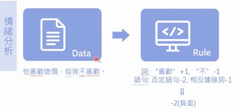
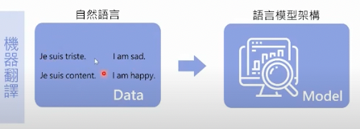
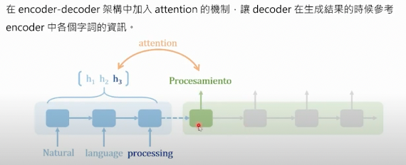
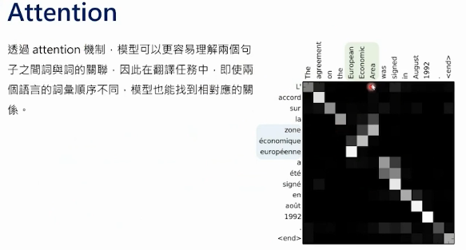
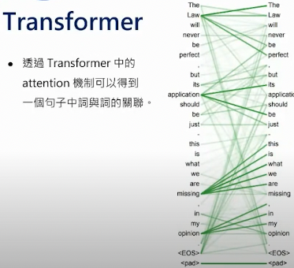
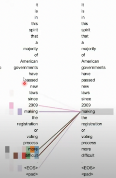
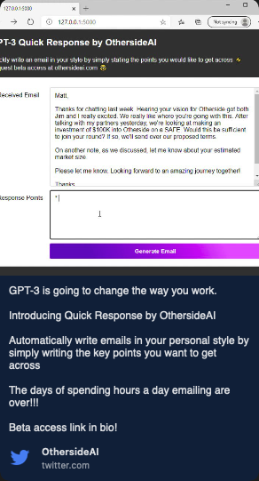

# **NLP理解筆記**

> NLP: Natural Language Processing

[TOC]

## 作法

通常包含兩個部分：

- 理解
- 生成

理解即是講字詞拆解後分析出其意義（以電腦語言來說就是數值大小）；生成則是依據對應的自然語句，所產生出來結果（以電腦語言來說就是計算出對應的結果）

其中包含幾個動作：

- 詞性標註 pos tagging
- 命名實體辨識 NER
- 解析 parser

## 常見運用場景

1. 智能助理（E.g. Siri, Google Assistant）
2. 機器翻譯（E.g. Google Translator）
3. 文本摘要（E.g. 新聞內容>>新聞標題）
4. 情緒分析（E.g. 文句情緒解析）

## 常見做法

### Rule-based

透過人工標記，將所有特定的組合、關聯程度進行表列，但此做法維護成本極高，且出現衝突時不易解決

以情緒分析為例，標注特定情緒字詞之正負面數值後，針對文本進行情緒計算，如下圖：

### Deep Learning

依如往常，以**大量資料**作為學習依據，生成出一個轉換模型，如下圖：

先暫停一下，***文字怎麼進行訓練***？在此介紹一個名詞：Ｗord2vec

> Ｗord2vec：透過大量文本資料計算出其“語義”，在電腦裡面為一個“詞向量(Word embedding)”

有了向量之後，我們就可以進行模型訓練了！

## NLP基本難題

### - 單詞界定與句法結構

- 我家門前很“難過” >> about action

- 心情很“難過” >> about mood

### - 詞意消歧

- ”蘋果“手機 >> some brand

- 吃了一顆“蘋果” >> real apple

### - 指示代名詞消解

- 老王喝酒，”他“宿醉

## 常見的模型架構：以翻譯任務作為例子

神經網路：以 Encoder-decoder(Seq2seq) 的概念，將文字逐一、依序放入網路中，透過 Decoder 來得到轉換結果。

另外會在架構中加上attention，其主要功用在回頭“查詢”與哪一個文字向量的關係最近，使得轉換結果更符合原始文本內的一致性。

而 Attention 可以得出字詞之間的關聯性，以得出更貼近的翻譯結果

### Seq2seq的演化：Transformer

取代以往的seq2seq，將文字“一次”放入

在encoder理解完之後，將資訊放在Kencdec、Vencdec當中，給decoder查詢利用(attention機制)。

GIF Source: [The Illustrated Transformer – Jay Alammar – Visualizing machine learning one concept at a time.](https://jalammar.github.io/illustrated-transformer/)

同樣地，我們也可以從transformer裡面的attention得到字詞彼此隻雞的關聯程度，

並且將句中的重點找出來。

## 其他網路上的應用範例

### 生成回覆信件

提供來信內容，以及列舉要回近的重點，進而生成出回覆信件(英文)

Source: [OthersideAI：GPT-3](https://twitter.com/othersideai/status/1285776335638614017?lang=en)

### 其他

若只是要判斷正負面：Bert應該就可以處理

## Reference

- [20220525【AI CAFÉ 線上聽】AI 也懂人話？機器學習在 NLP 的基礎概念](https://www.youtube.com/watch?v=W-dBc2Xzr4s)
- [The Illustrated Transformer – Jay Alammar – Visualizing machine learning one concept at a time.](https://jalammar.github.io/illustrated-transformer/)
- [OthersideAI (@OthersideAI) / Twitter](https://twitter.com/OthersideAI)

## 