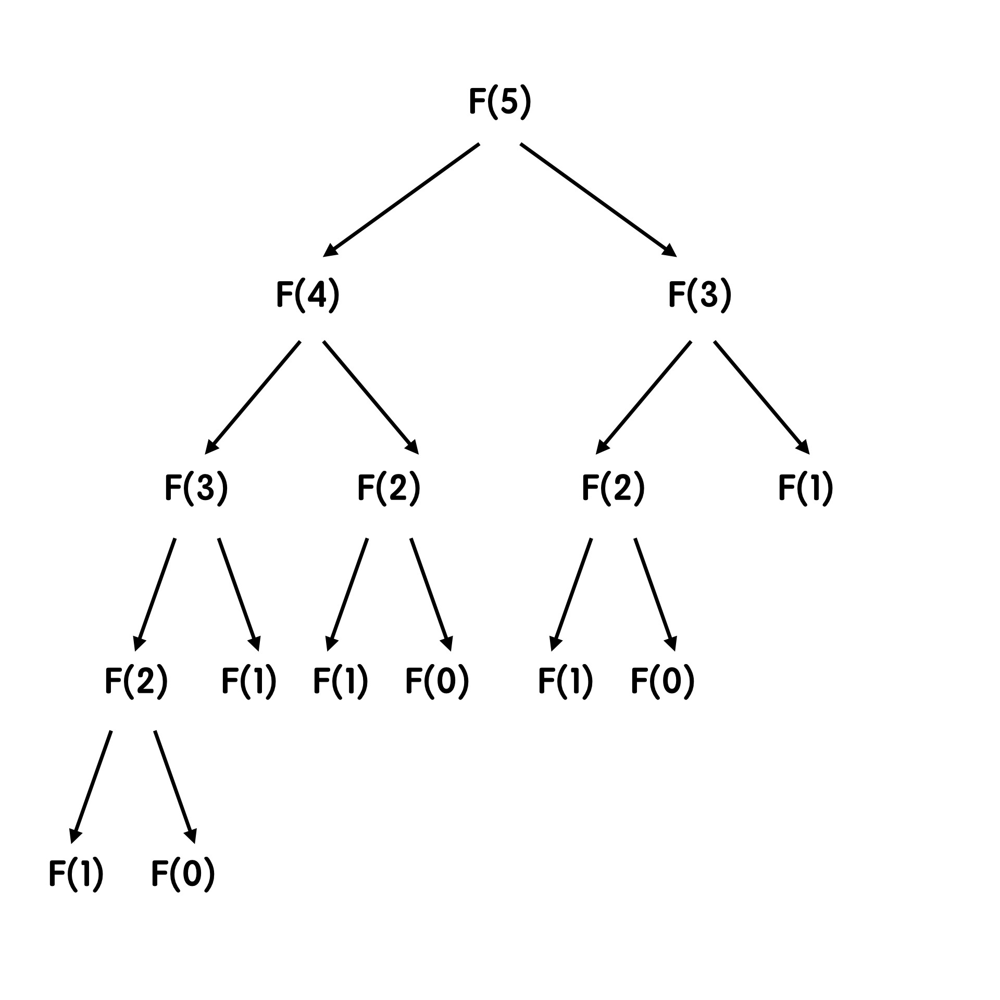
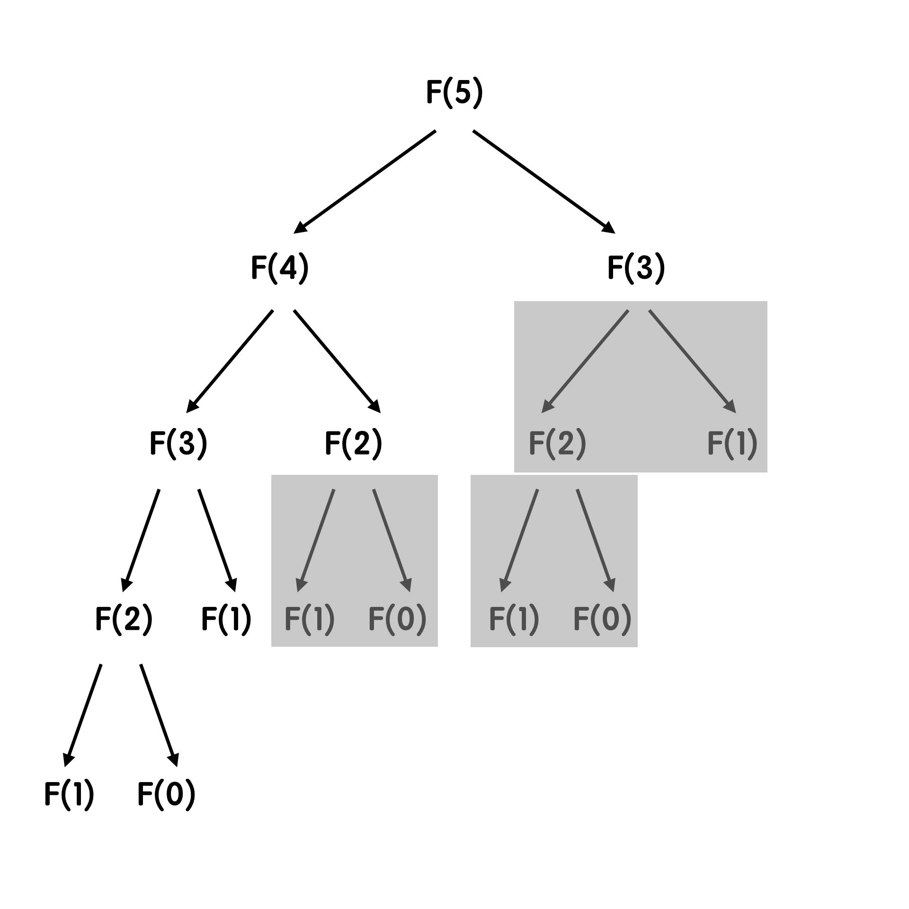

# Functions

[TOC]

## Defining a Function

```python
def function_name(parameters):
	statement(s)
    return value1, value2, ...
```


## `sorted()` Function

```python
sorted(iterable, key=None, reverse=False)
```

| Parameter  | Required? | Default Value | Description                                                  |
| ---------- | :-------: | :-----------: | ------------------------------------------------------------ |
| `iterable` |   ✔️ Yes   |      NA       | An ordered sequence (string, tuple, list) or an unordered collection (set, dictionary) or any other iterator. |
| `key`      |   ❌ No    |    `None`     | A function that serves as a key for the sort comparison.     |
| `reverse`  |   ❌ No    |    `False`    | If `True`, the sorted list is reversed (sorted in descending order). |

### Example

```python
import random as rd
list1 = rd.sample(range(1,21),20)
print(f'Original random list: {list1}.')

def sum_of_digits(x):			#把數字加起來 E.g. 12 >> 1+2=3
    return sum([int(a) for a in str(x)])

print(f"Sorted according to sum of digits : {sorted(list1, key = sum_of_digits)}.")
```

```
Original random list: [14, 6, 16, 20, 12, 18, 8, 17, 7, 15, 19, 5, 3, 13, 4, 10, 2, 11, 1, 9].
Sorted according to sum of digits : [10, 1, 20, 2, 11, 12, 3, 13, 4, 14, 5, 6, 15, 16, 7, 8, 17, 18, 9, 19].
```


## `Lambda`

> By given a function in a single line.

```python
lambda arg1, arg2, ...: return_value
```

### Example

```python
import random as rd
list1 = rd.sample(range(1,21),20)
print(f'Original random list: {list1}.')

print(list1) # random integers (generated above).
print(sorted(list1, key = lambda x: sum([int(a) for a in str(x)])))
```

```
Original random list: [14, 6, 16, 20, 12, 18, 8, 17, 7, 15, 19, 5, 3, 13, 4, 10, 2, 11, 1, 9].
[10, 1, 20, 2, 11, 12, 3, 13, 4, 14, 5, 6, 15, 16, 7, 8, 17, 18, 9, 19]
```


## Namespaces

A **namespace** is a ***collection of currently defined variable names along with information about the object that each name references***. A namespace is a mapping from names to objects. We can think of a namespace as a dictionary in which the keys are the object names and the values are the objects themselves.

### Global versus Local

#### Global

```python
def func(x): #parameter x is a local variable
    global b #this b is a global variable
    b = 10   #global b is now set to 10
    a = b + x
    return a

b = 2
print(func(b))
print(b)
```

```
12
10
```

#### Local

```python
def func(x):
    b = 10
    a = b + x #b refers to the local b, not the global b
    return a

b = 2
print(func(b))
print(b)
```

```
12
2
```

> **Caution**: Accessing global variables from within functions should be avoided as much as possible. Passing values via parameters and returning values is usually preferable because it keeps different parts of the code as **independent** of each other as possible.


## Recursion遞迴呼叫

[參考來源](https://medium.com/appworks-school/初學者學演算法-從費氏數列認識何謂遞迴-dea15d2808a3)

> 在函數中呼叫自己。

### 舉例: Fibonacci numbers

> 每一項數字是前兩項的和。

```python
def fibo(n):
    if n == 0:
        return 0;
    elif n == 1:
        return 1;
    return fibo(n-1) + fibo(n-2)
```

每往回推一次，就會需要知道前兩項；而這兩項又***各自需要知道<u>其各自的前兩項</u>***，如下圖所示。而最後都會停在 $F(0),\ F(1)$ ，唯一被定義的兩項，從這兩項開始往樹枝的源頭 $F(5)$ 回頭加總。



#### 延伸：時間複雜度

而每一次回推都會產生新的一層，最終產生 $n$ 層 (最多，並不是每個分支都會展開到這麼多)；而同時每往下一層，都會產生 $2$ 個新的項目，直到被定義的 $F(0),\ F(1)$ 兩項為止。

依據時間複雜度的討論，此函數的時間複雜度為 $O(2^n)$。

> 此計算方式為簡便法，實際上並不是每個分支都會展開到 $n$ 層；依據前人辛苦的計算算後，**Fibonacci number** 的時間複雜度精確為 $O(1.618^n)$ ( $1.618$ A.K.A 黃金比例)。

優化：應該有注意到，當中的 $F(3),\ F(2)$ 各自重複計算了 $2,\ 3$ 次，拖慢了整體計算的效率。範例中透過『空間換取時間』的方式，將計算過的值記錄在一張大表當中，後續直接查表就好。

以 $F(5)$ 作為例子進行優化：

- 每一個 $F(n)$ 都必須要進行的動作有：**讀取** $F(n-1),\ F(n-2)$ ，接著**加總**，總計 $3$ 個動作

- 將 $F(5)$ 底下樹枝重複的的部分剔除 (灰底) ，總共會出現 $5-1$ 次 **讀取＋加總**

    

    故優化過後，總共需要 $3 \times (5-1)=12$ 次步驟，比原本 $2^5=32$ 次步驟減少一半以上 $\Rightarrow$ 推廣到 $F(n)$ ，總共將會需要 $3 \times (n-1)$ 次步驟，因此時間複雜度減少至 $O(n)$ 。 

[Top](#Functions)


## Functiontools

### LRU Cache

Explain: [LRU Cache implement in Python](https://www.geeksforgeeks.org/python-lru-cache/)

#### `@lru_cache(maxsize=128, typed=False)`

| Parameter     | Required? | Default Value | Description                                                  |
| ------------- | :-------: | :-----------: | ------------------------------------------------------------ |
| `maxsize=128` |   ❌ No    |     `128`     | The size of the cache, the cache can store upto maxsize most recent function calls, if maxsize is set to None, the LRU feature will be disabled and the cache can grow without any limitations. |
| `typed`       |   ❌ No    |    `False`    | If typed is set to `True`, function arguments of different types will be cached separately. For example, f(3) and f(3.0) will be treated as distinct calls with distinct results and they will be stored in two separate entries in the cache. |

Comparing with and without `@lru_cache`

```python
from functools import lru_cache
import time

# Function that computes Fibonacci
# numbers without lru_cache
def fib_without_cache(n):
	if n < 2:
		return n
	return fib_without_cache(n-1) + fib_without_cache(n-2)
	
# Execution start and end time
begin = time.time()
fib_without_cache(30)
end = time.time()

print("Time taken to execute the function without lru_cache is", end-begin)

# Function that computes Fibonacci
# numbers with lru_cache
@lru_cache(maxsize = 128)
def fib_with_cache(n):
	if n < 2:
		return n
	return fib_with_cache(n-1) + fib_with_cache(n-2)
	
# Execution start and end time
begin = time.time()
fib_with_cache(30)
end = time.time()

print("Time taken to execute the function with lru_cache is", end-begin)
```

```
Time taken to execute the function without lru_cache is 0.17377090454101562
Time taken to execute the function with lru_cache is 4.410743713378906e-05
```

[Top](#Functions)
