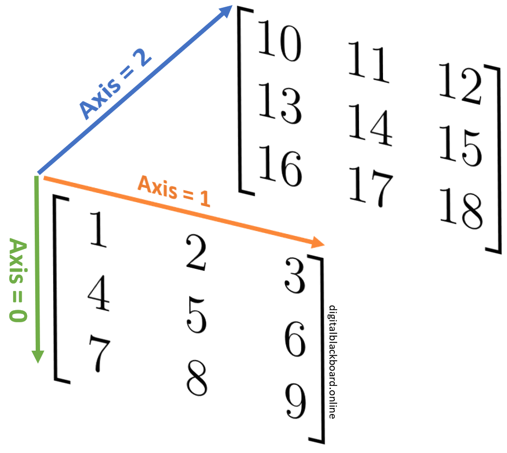

# 7.Array Concatenation

[TOC]

> Joining arrays together.

## 7.1.`numpy.concatenate()`

```python
numpy.concatenate((a1, a2, ...), axis=0, out=None, dtype=None)
```

|   Parameter   | Required? | Default Value | Description                                                  |
| :-----------: | :-------: | :-----------: | ------------------------------------------------------------ |
| `a1, a2, ...` |   ✔️ Yes   |      NA       | Input arrays must have the same shape, except in the dimension corresponding to `axis`. |
|    `axis`     |   ❌ No    |       0       | The axis along which the arrays will be joined. If `axis` is `None`, arrays are flattened before use. |
|     `out`     |   ❌ No    |    `None`     | 鎖定輸出維度。If provided, the destination to place the result. The shape must be correct, matching that of what concatenate would have returned if no out argument were specified. |
|    `dtype`    |   ❌ No    |    `None`     | If provided, the destination array will have this dtype. Cannot be provided together with out. |

**Note**: All the input arrays ***must have the same number of dimensions***.


### 7.1.1 1-D Joining

```python
import numpy as np

ar = np.arange(1, 10).reshape((3, 3)) # create 2D array
x = ar[0, :] #[1 2 3]
y = ar[1, :] #[4 5 6]
z = ar[2, :] #[7 8 9]

print(np.concatenate((x, y, z), dtype=float))
```

```
[1., 2., 3., 4., 5., 6., 7., 8., 9.]
```


### 7.1.2 2-D Joining

```python
ar2 = np.arange(10, 19).reshape((3, 3))
ar3 = np.arange(19, 28).reshape((3, 3))
np.concatenate((ar2, ar3))
np.concatenate((ar2, ar3), axis=1)
np.concatenate((ar2, ar3), axis=None)
np.concatenate((ar, ar2, ar3), axis=1)
```

```
array([[10, 11, 12],
       [13, 14, 15],
       [16, 17, 18],
       [19, 20, 21],
       [22, 23, 24],
       [25, 26, 27]])

array([[10, 11, 12, 19, 20, 21],
       [13, 14, 15, 22, 23, 24],
       [16, 17, 18, 25, 26, 27]])

array([10, 11, 12, 13, 14, 15, 16, 17, 18, 19, 20, 21, 22, 23, 24, 25, 26, 27])

array([[ 1,  2,  3, 10, 11, 12, 19, 20, 21],
       [ 4,  5,  6, 13, 14, 15, 22, 23, 24],
       [ 7,  8,  9, 16, 17, 18, 25, 26, 27]])
```


### Caution

> The `numpy.concatenate` function only concatenates arrays along an **existing** axis

```python
np.concatenate((x, ar2))
```

```bash
ValueError: all the input arrays must have same number of dimensions
```

But using either **[reshape](Numpy_Array_Reshaping.md#5.1.Reshaping Examples)** or **[numpy.newaxis](Numpy_Array_Reshaping.md#5.3.Method: numpy.newaxis())** to convert 1-D into 2-D.

```python
#Both work
np.concatenate((x[np.newaxis, :], ar2))
np.concatenate((x.reshape(1, 3), ar2))
```


## 7.2.`numpy.vstack()`

```python
print(np.vstack((x, ar2)))
```

```
[[ 1,  2,  3],
 [10, 11, 12],
 [13, 14, 15],
 [16, 17, 18]]
```


## 7.3.`numpy.hstack()`

```python
print(np.hstack((x.reshape(3, 1), ar2)))
print(np.hstack((x, ar2[0, :])))
```

```
[[ 1, 10, 11, 12],
 [ 2, 13, 14, 15],
 [ 3, 16, 17, 18]]

[ 1,  2,  3, 10, 11, 12]
```


## 7.4.`numpy.stack()`

> Joining a sequence of arrays **along a new axis**.

```python
numpy.stack((a1, a2, ...), axis=0, out=None)
```

|   Parameter   | Required? | Default Value | Description                                                  |
| :-----------: | :-------: | :-----------: | ------------------------------------------------------------ |
| `a1, a2, ...` |   ✔️ Yes   |      NA       | Each array must have the same shape.                         |
|    `axis`     |   ❌ No    |       0       | The axis in the result array along which the input arrays are stacked. |
|     `out`     |   ❌ No    |    `None`     | 鎖定輸出維度。If provided, the destination to place the result. The shape must be correct, matching that of what stack would have returned if no out argument were specified. |


### 7.4.1.Examples



```python
print(np.stack((ar, ar2), axis=0)) #turn into (2, 3, 3) 3-D array
```

```
[[[ 1,  2,  3],
  [ 4,  5,  6],
  [ 7,  8,  9]],

 [[10, 11, 12],
  [13, 14, 15],
  [16, 17, 18]]]
```


```python
print(np.stack((ar, ar2), axis=1)) #turn into (3, 2, 3) 3-D array
```

```
[[[ 1,  2,  3],
  [ 4,  5,  6]],

 [[ 7,  8,  9],
  [10, 11, 12]],

 [[13, 14, 15],
  [16, 17, 18]]]
```


```python
print(np.stack((ar, ar2), axis=2)) #turn into (3, 3, 2) 3-D array
```

```
[[[ 1, 10],
  [ 2, 11],
  [ 3, 12]],

 [[ 4, 13],
  [ 5, 14],
  [ 6, 15]],

 [[ 7, 16],
  [ 8, 17],
  [ 9, 18]]]
```


[Back to Intro](Numpy_Array_Intro.md)
