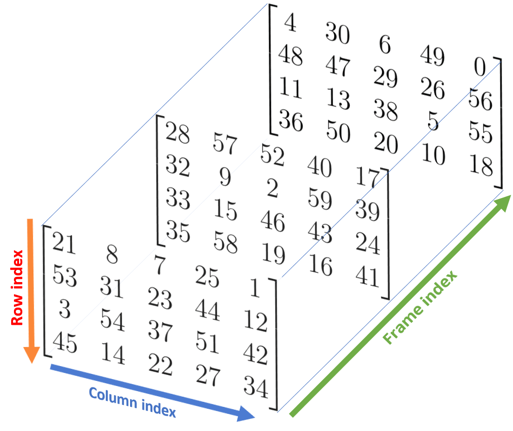

# 3.Array Slicing

[TOC]

## 3.1.Recap Example

*E.g.1*

```python
import numpy as np
R = np.random.RandomState(32) #set a random seed

a1 = R.choice(10, size=10, replace=False)
print(a1)
```

```bash
[9 1 2 8 3 0 4 6 5 7]
```

*E.g.2*

```python
a2 = R.choice(3 * 4, size=(3, 4), replace=False)
print(a2)
```

```bash
[[ 8 10  0  2]
 [ 6  7  1 11]
 [ 4  9  5  3]]
```

*E.g.3*

```python
a3 = R.choice(3 * 4 * 5, size=(3, 4, 5), replace=False)
print(a3)
```

```bash
[[[21  8  7 25  1]
  [53 31 23 44 12]
  [ 3 54 37 51 42]
  [45 14 22 27 34]]

 [[28 57 52 40 17]
  [32  9  2 59 39]
  [33 15 46 43 24]
  [35 58 19 16 41]]

 [[ 4 30  6 49  0]
  [48 47 29 26 56]
  [11 13 38  5 55]
  [36 50 20 10 18]]]
```


## 3.2 1-D array

```python
array[start=0:stop=size of array:step=1]
```

*E.g.1*

```python
print(a1[:7:2])
```

```
[9, 2, 3, 4]
```

*E.g.2*(mixed indices)

```python
print(a1[::-1]) #reversed
```

```
[7, 5, 6, 4, 0, 3, 8, 2, 1, 9]
```

*E.g.3*(mixed indices)

```python
print(a1[5:1:-1]) #reversed from index 5 to 2
```

```
[0, 3, 8, 2]
```

*E.g.4*(mixed indices)

```python
print(a1[-3:-8:-2]) #from
```

```
[6, 0, 8]
```

> **Note**: 只要是倒序，step就要給定，否則為空

## 3.3 2-D array

```python
array[start=0:stop=n1:step=1, start=0:stop=n2:step=1]
```

*E.g.1*

```python
print(a2[:2, :])
```

```
[[ 8, 10,  0,  2],
 [ 6,  7,  1, 11]]
```

*E.g.2*

> To access the rows of a 2-D array, we can simply insert an array of row indices within the square brackets: `a2[row_indices]`.

```python
print(a2[[0, 2]])
```

```
[[ 8, 10,  0,  2],
 [ 4,  9,  5,  3]]
```

*E.g.3* Reversing also work

```python
print(a2[::-1, :])
print(a2[:: , ::-1])
```

```
[[ 4,  9,  5,  3],
 [ 6,  7,  1, 11],
 [ 8, 10,  0,  2]]
 
[[ 2,  0, 10,  8],
 [11,  1,  7,  6],
 [ 3,  5,  9,  4]]
```


## 3.4 3-D array

```python
array[start=0:stop=n1:step=1, start=0:stop=n2:step=1, start=0:stop=n3:step=1]
```

| `stop` index |           Code           |    Description     |
| :----------: | :----------------------: | :----------------: |
|     `n1`     | `numpy.ndarray.shape[0]` | Number of frames.  |
|     `n2`     | `numpy.ndarray.shape[1]` |  Number of rows.   |
|     `n3`     | `numpy.ndarray.shape[2]` | Number of columns. |

3-D array concept:



*E.g.1*

```python
print(a3[:, :, 3]) #所有Frame的所有row的index 3 col
```

```
[[25, 44, 51, 27],
 [40, 59, 43, 16],
 [49, 26,  5, 10]]
```

*E.g.2*

```python
print(a3[1:, 1:3, ::2])
```

```
[[[32,  2, 39],
  [33, 46, 24]],

 [[48, 29, 56],
  [11, 38, 55]]]
```


[Back to Intro](Numpy_Array_Intro.md)
