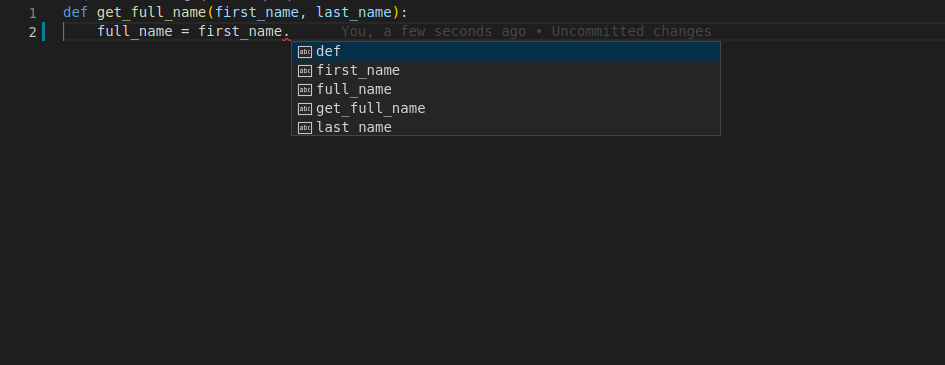
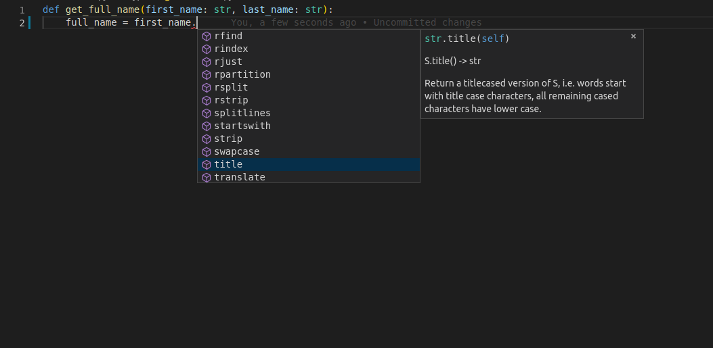

# Type Hint

編輯函數時並非每一個功能都滾瓜爛熟（當然也是有神人），因此 **從頭** 開始撰寫一項功能時，我們非常需要一些 **提示** ，下方範例展示如何提高我們撰寫時的效率：


範例：拿到姓名後，將字首改成大寫，最後印出全名

```python
def get_full_name(first_name, last_name):
    full_name = first_name.title() + " " + last_name.title()
    return full_name

print(get_full_name("john", "doe"))
```

Outputs:

```
John Doe
```


範例看來單純，不就是利用 `str` 的性質嗎？但常常在實作當下就是會有很多的自我懷疑， `upper`、`uppercase` 、`first_uppercase` 、`capitalize` 哪一種才對？

以 VScode 使用為例，按下 `.` 之後都會跑出一些提示，希望能從提示中快速找到所需要的那一個，然而卻找不到，如下圖的狀況：



此時只要把輸入的內容

```python
    first_name, last_name
```

加上類別作為宣告

```python
    first_name: str, last_name: str
```

此時小天使就會出現，並在適當的時間點幫助你找到你所需要的功能特性（如下圖）

