[TOC]


## 基本UML 類別圖

- #### 類別(Class)：

  `-`代表`private`, `+`代表`public`, `#`代表`protected`

  <div align="center">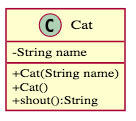</div>

- #### 抽象類別(Abstract Class)

  <div align="center">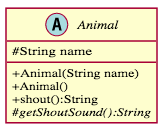</div>

- #### 接口(Interface)

  <div align="center">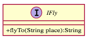</div>

- #### 繼承(Inheritance) (包含抽象類別、接口)

  <div align="center">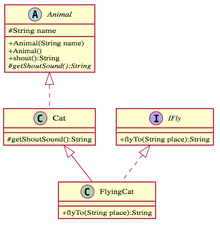</div>

- #### 關聯關係(Association)：

  Ａ類把Ｂ類當作成員變數，但Ａ不擁有Ｂ(has-a)。

  <div align="center">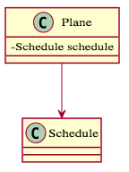</div>

- #### 聚合關係(Aggregation)：

  Ａ類把Ｂ類當作成員變數，Ａ擁有Ｂ，但**拿掉Ｂ之後Ａ可以獨立存在**，稱之為Ａ聚合到Ｂ(owns-a)。

  <div align="center">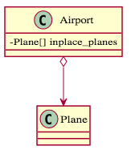</div>

- #### 合成關係(Composition)：

  Ａ類把Ｂ類當作成員變數，Ａ擁有Ｂ，且Ｂ為組成Ａ的一部分，稱之為Ａ合成到Ｂ(is-part-of-a)。

  <div align="center">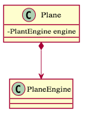</div>

- #### 依賴關係(Dependency)：

  Ａ類「僅使用」到Ｂ類的關係。E.g. Ｂ作為Ａ的參數、Ｂ作為Ａ的 local variable、Ａ調用Ｂ的靜態方法、Ａ最終回傳Ｂ這個類別，稱之為Ａ依賴Ｂ(uses-a)。

  <div align="center">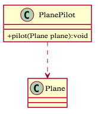</div>


## 物件導向基本原則

1. ### 單一職責原理(Single Responsibility Principle, SRP)

   > There should never be more than one reason for a class to change. 一個類別中不要有多於一個以上的變化理由

   一個類別中不要做超過一件事，目的為提高內聚性；但實務上不會真的做到，容易影響整隻程式碼的易讀程度，但最起碼會要求到『接口單一原則』

2. ### 開閉原理(Open-Closed Principle, OCP)

   > Software entities (classes, modules, functions, etc.) should be open for extension, but closed for modification. 軟體中的實體，例如：類、模組、函數等等，都必須對延伸開放，但對修改封閉

   一個模組、類別、函數應該保有延伸性，但同時對修改保有一定程度的封閉性。換言之，內聚性高則可避免未來的大改，同時彼此間的耦合程度要低，才能有較高的彈性進行任意組合、擴充。

   簡言之，『高內聚、低耦合』有利於單元測試，同時提高維護＆擴充能力。

3. ### 里氏替換原則(Liskov Subsititution Principle, LSP)

   > Following substitution property: If for each object o1 of type S there is an object o2 of type T such that for all programs P defined in terms of T, the behavior of P is unchanged when o1 is substituted for o2 then S is a subtype of T. 
   >
   > 子類對象能夠替換其父類對象，使用父類方法而不會有問題

   理想情況下「父類必須等於子類們的交集」，所以「父類必定是任一子類的子集合」，因此「使用子類來執行父類是不應該有問題的」。如果子類不能完整地實現父類的方法，或者父類的某些方法在子類中已經發生了「畸變」，則建議斷開父子繼承關係，採用依賴、聚集、組合等關係替代。

   繼承主要是為了要避免Repeat Yourself而生，我們找出各種類別共享的屬性和方法，把它獨立出來，然後大家再一起繼承自它，所以我們要盡可能的避免父類出現不是共享的性質，接著透過先寫一段父類的執行代碼，然後把父類替換成子類，然後再跑跑看能不能正常執行，如果正常執行代表這個繼承關係是健康的。

   如下圖示，父類應取自子類的交集(圖左)。

   <div align="center">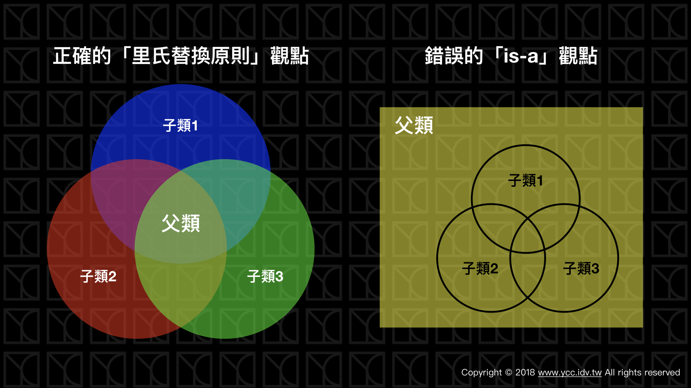</div>

   (圖片參考並取自https://www.ycc.idv.tw/)

4. ### 狄米特法則(Law of Demeter, LoD)

   > 1. Each unit should have only limited knowledge about other units: only units "closely" related to the current unit.
   > 2. Each unit should only talk to its **friends**; don't talk to strangers.
   > 3. Only talk to your immediate friends.

   又稱之為『最少知識原則』。舉例：對於一個類別Ｃ當中的所有方法Ｍ，Ｍ僅能訪問以下物件：

   - `self`，類別C自身
   - M的輸入參數
   - C的成員變數
   - M的輸出物件
   - 全域變數的物件

   白話總結：

   1. 僅能訪問那些類別出現在自身、成員變數、方法的輸入和輸出參數中的方法。
   2. 減少類別的對外方法，將沒必要對外公布的方法隱藏起來。 

   （詳解）僅能訪問那些類別出現在自身、成員變數、方法的輸入和輸出參數中的方法。

   既然無法斷開耦合，何不**運用到底，運用這些「朋友」來完成任務，不要再去增加其他的耦合性，也同時幫助提升類別的內聚性**，這就是「迪米特法則」真正想做的事。

   

   **範例**(降低耦合)：老師給了學生名條想叫班長幫忙點名

   ```python
   class Student: #friends: None
       def __init__(self, name):
           self.name = name
   
   class Leader: #friends: Student
       def giveNameList(self, name_list):
           student_list = []
           for name in name_list:
               student_list.append(Student(name))  
           self.__student_list = student_list
   
       def countStudents(self):
           print("Total number of students is " + len(self.__student_list))
   
   class Teacher: #friends: Leader
       def command(self, name_list, leader):
           leader.giveNameList(name_list)
           leader.countStudents()
   
   if __name__ == "__main__":
       teacher = Teacher()
       leader = Leader()
       name_list = ['A', 'B', 'C', 'D', 'E']
       teacher.command(name_list, leader)
   ```

   <div align="center">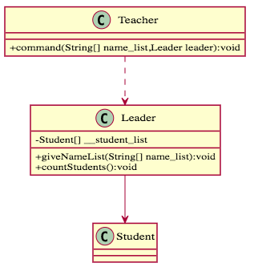</div>

   **舉例**(減少資訊暴露)：安裝程式，不需要公開安裝細節，將細節都私有化，僅提供安裝動作。

   ```python
   class Wizard: # only 1 public method
       def install(self,mode):
           self.__first()
           self.__second(mode)
           self.__third()
   
       def __first(self):
           print("Install first step of wizard")
       def __second(self, mode):
           print("Install second step of wizard at mode " + mode)
       def __third(self):
           print("Install third step of wizard")
   
   class Install:
       def install(self, wizard, mode):
           wizard.install(mode)
   ```

   

5. ### 依賴倒置原則(Dependence Inversion Principle, DIP)

   > High level modules should not depend upon low level modules. Both should depend upon abstractions. Abstractions should not depend upon details. Details should depend upon abstractions. 高層次模組不應該依賴低層次模組，兩者都應該依賴抽象。而抽象不應該依賴細節，反之細節應該要依賴抽象

   依賴倒置原則又稱為「面向接口原則」，這裡的接口應該想的更廣義一點，不侷限在interface上，我認為只要藉由抽象化將架構擬定出來的這些抽象單元都可以稱作接口，「廣義的接口」可以是指：

   - 客戶端和業務邏輯的分離介面
   - 物件的開放方法
   - 抽象類別
   - 定義行為的interface

   不讓作為實現的類別彼此依賴，而是使用接口將抽象架構擬定好，再讓類別去依賴接口實現目標。

   舉例：玩具車開發過程中，夠過先將**抽象類別(如下圖Ａ標)**定義出來，再讓陸續推出的產品去依賴這樣的架構，避免因為產品架構耦合程度太高導致擴充困難。(如下圖示)

   <div align="center">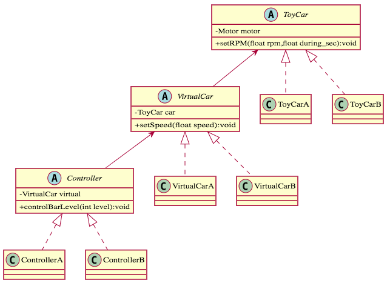</div>

6. ### 接口分隔原則(Interface Segregation Principle, ISP)

   > Clients should not be forced to depend uponn interfaces that they don't use. The dependency of one class to another one should depend on the smallest possible interface. 客戶類不應該被強迫依賴那些它不需要的接口，類別間的彼此依賴應該建立在盡可能小的接口上

   文章作者建議遵守『單一職責原理』的程度即可，可避免過於架構零碎；其中 Interface 一定要遵守『單一職責原理』。

   **舉例**(延伸玩具車開發)：若是單純要新增另一種控制方法(E.g. 方向盤控制)，原本的抽象類別 Controller `IMotor`、`ISpeed`、`IControlBar` 就會顯的不夠用且開始有多工的狀況。

   <div align="center">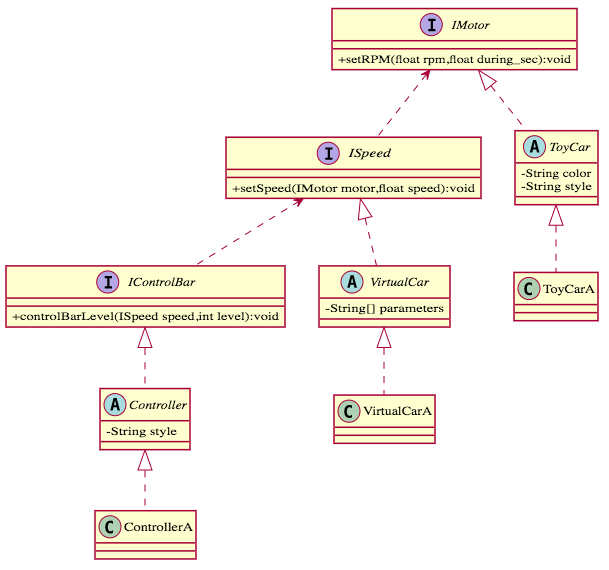</div>

   因此當添加新「方向盤」的功能，也能輕鬆的擴充，如下所示。

   `ToyCarPlus`、`VirtualCarPlus`、`ControllerPlus` 是我們實作最新產品的抽象類別，它現在可以直接套用`IMotor`、`ISpeed`、`IControlBar` 的Interface，同時又具有`IWheel`、`ITurn`、`IButton` 這些方向盤的Interface。

   <div align="center">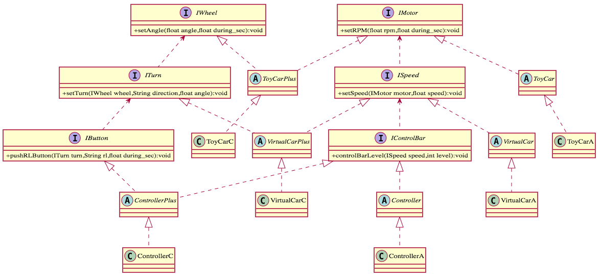</div>

## Summary

這些原則所要達到的目的，不外乎就是：

1. 「正常執行」
2. 「穩健」
3. 「不重複撰寫」
4. 「可讀性」
5. 「可擴展」
6. 「低耦合、高內聚」

原文作者建議：

- 在開發程式的初期，先定義好抽象架構，也就是廣義的接口，徹底的使客戶端與業務邏輯分離，將「行為」定義成Interface，將「類別的泛化」定義成Abstract Class。
- 所有的實體類別都依賴於抽象，細節依賴於抽象。
- 每個單元盡量達到：單一權責、對延伸開放但對修改封閉、盡可能少的對外方法。
- 牽涉「繼承」，必須要問自己：子類可以替換父類執行嗎？父類是不是為子類的交集？
- 類別中的方法僅能訪問那些類別出現在自身、成員變數、方法的輸入和輸出參數中的。


## Reference

- [物件導向武功秘笈（3）：內功篇 — 物件導向指導原則SOLID](https://www.ycc.idv.tw/introduction-object-oriented-programming_3.html)