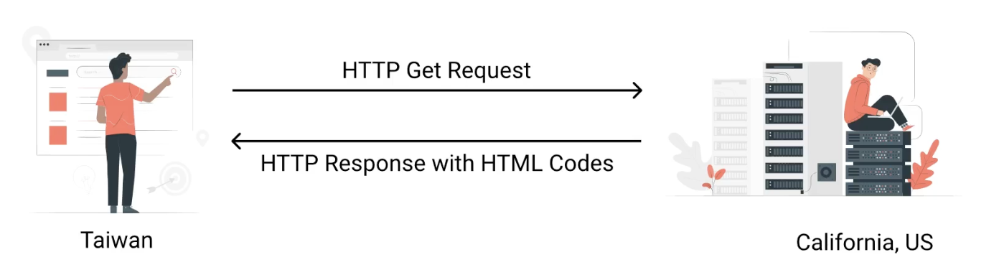
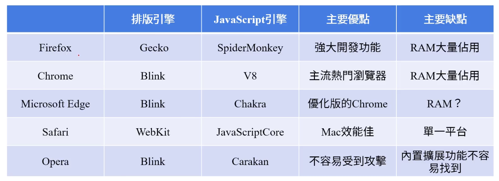

# 名詞解釋

## Internet

20世紀末，電腦網路與電腦網路之間所串連而成的龐大網路系統。網路之間的溝通遵守標準網路協定相互連接。

## WWWW

A.K.A. `World Wide Web`，全球資訊網，倚靠網際網路運行的服務之一。

## HTTP

網路協議。定義在電腦內，如何交換資料的系統化規則。常見的還有SMTP(Simple Mail Transfer Protocol)、FTP(File Transfer Protocol)等等。

HTTP(HyperText Transfer Protocol)是一種用於分布式、協作式與超媒體訊息系統的協定，是全球資訊網的數據通信基礎。

HTTPs represents HyperText Transfer Protocol Secure. 傳輸的資訊經由RSA演算法加密，確保資訊安全。

## Server & Client

1. Client: send request
2. Server: `get` request
3. Server: send `response` back to client

用戶端(Client)泛指用戶，使用可上網設備。伺服器(Server)指放置內容並提供給用戶端訪問。一般常用的工具`瀏覽器`則是負責將提供的內容展示成可被解讀的形式。

## DNS

Domain Name Servers網域名稱服務，轉換IP、URL的服務。瀏覽器會先到DNS查到網站的真實地址(用URL查IP，真實位址)，把HTTP請求傳送到正確的位址(IP)。

1. 瀏覽器先去DNS找到託管網站的Server
2. 瀏覽器向Server發送HTTP請求(request)，請求Server傳送網站程式碼給Client
3. Server若允許這個request，會回傳`200`，意指允許訪問。接著Server開始傳送`封包`，裡面包含網站的內容。
4. 瀏覽器將`封包`一一組合成完整網站並呈現出來。

## 瀏覽器

包含兩個主要功能：

1. 排版：把HTML文檔與其他資源呈現出來
2. JavaScript：負責處理JavaScript指令碼的虛擬機器

