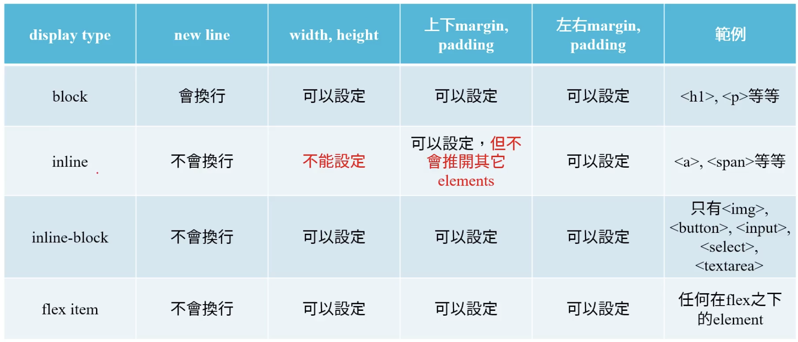

# CSS

> Cascading Style Sheets，用來控制HTML的外觀與佈局。包含字體、顏色、尺寸、間距、邊框、背景、浮動、定位等等。

## DOM Tree

**Document Object Model**，加載到瀏覽器當中的樹狀表示。


Inside nesting structure:
- Parent Node (Parent element)
- Child Node (Child element)

這兩者可以互相嵌套，形成一個樹狀的結構。

## 可放置的位置

- **Inline** only apply to current element
  ``` html
  <h1 style="color: green"></h1>
  ```
  設定對象較為侷限，不易維護。

- **Internal** only apply to current page
  ``` html
  ``` html
  <head>
    <style>
      h1 {
        color: green;
      }
    </style>
  </head>
  ```
  若頁面較多，則需要在每個頁面都加入，不易維護，且會造成頁面載入時間過長。

- **external** apply to all pages linked to this file
  ``` html
  <link rel="stylesheet" href="style.css">
  ```
  一個獨立的檔案，可在所有頁面中使用，且只需載入一次，容易維護且可大幅減少頁面載入時間。

Priority: *inline* > *internal* > *external*


## CSS 重要概念

> Cascading Style Sheets，層疊樣式表

- Inheritance繼承

    常見可被繼承的屬性有：
    - color
    - font-family
    - font-size
    - list-style-type
    - text-align
    更多可參考[連結](https://www.w3.org/TR/CSS21/propidx.html)。

    User agent (or user stylesheet)優先度較高，可覆蓋繼承的屬性。而瀏覽器預設為User的代理人，因此要注意瀏覽器預設的樣式可能會影響到網頁的呈現，因此`<a>`通常需要額外設定。

- Conflicting Styling

    同一個 tag 若有兩個以上的樣式設定，則會以最後一個為主。

    若衝突是發生在不同的樣式表中，則會以最後載入的樣式表為主。

    衝突處理原則：

    - Priority 優先度
        1. inline style
        2. user stylesheet
        3. user agent stylesheet
        4. inheritance
    - Specificity 特定度
        當一個 tag 同時有 id、class、tag 時，會依照以下順序優先度較高：
        1. id (100)
        2. class (010)
        3. tag (001)
    - Order 順序
        若優先度與特定度相同，則會依照樣式表的順序來決定。

## 顏色設定

- Color name
  ``` css
  h1 {
    color: red;
  }
  ```
  有限的顏色名稱，不易維護。

- RGB
  ``` css
  h1 {
    color: rgb(255, 0, 0);
  }
  ```
    紅、綠、藍，0為最暗，255為最亮，每個值都介於0~255之間，每個值都用1byte（8bit）來表示。

- rgba
  ``` css
  h1 {
    color: rgba(255, 0, 0, 0.5);
  }
  ```
    第四個為透明度，0為完全透明，1為完全不透明。

- HEX
  ``` css
  h1 {
    color: #ff0000;
  }
  ```
    16進位，每個值都用2byte（16bit）來表示。

- HSL
  ``` css
  h1 {
    color: hsl(0, 100%, 50%);
  }
  ```
    Hue（色相）、Saturation（飽和度）、Lightness（亮度），色相為0~360，飽和度為0~100%，亮度為0~100%。

For more information, please refer to [CSS Color](https://www.w3schools.com/css/css_colors.asp).

## CSS Selectors

### Selector

- Universal Selector
  ``` css
  * {
    color: red;
  }
  ```
  選取所有元素。

- Element Selector
  ``` css
  h1 {
    color: red;
  }
  ```
  選取所有`h1`元素。

- ID Selector
  ``` css
  #my_id {
    color: red;
  }
  ```
  開頭`#`選取所有`id`為`my_id`的元素。`id`為唯一值，不可重複。

- Class Selector
    ``` css
    .my_class {
        color: red;
    }
    ```
    開頭`.`選取所有`class`為`my_class`的元素。`class`可重複，多個`class`用空格分開。
    ``` html
    <h1 class="my_class1 my_class2">Hello World</h1>
    ```
    
    ``` css
    .my_class1.my_class2 {
        color: red;
    }
    ```

ID, Class, Element Selector 以及其他tag可以互相組合使用，例如：
``` css
/*eg1*/
#my_id.my_class {
    color: red;
}

/*eg2*/
a.my_class {
    color: red;
}

/*eg3*/
a#my_id {
    color: red;
}
```

Selector Priority:
ID Selector > Class Selector > Element Selector

- Group Selector
    ``` css
    h1, h2, h3 {
        color: red;
    }
    ```
    選取所有`h1`、`h2`、`h3`元素。

- Descendant Selector
    ``` html
    <h2>
        <span>Hello World</span>
    </h2>
    ```

    ``` css
    h2 span {
        color: red;
    }
    ```
    選取所有`h2`元素中的`span`元素。依據DOM Tree，的結構，範例中`span`為`h2`的子元素，非透過`id`或`class`來選取。

- Attribute Selector
    ``` css
    input[type="password"] {
        color: red;
    }
    ```

- Others

  -  Pseudo-class

        指定元素的特殊狀態。例如當元素被點擊時，會變成`:active`狀態；或是`:hover`則是當滑鼠移動到元素上時會變成的狀態。

        ``` css
        input[type="text"]:active {
            color: green;
        }
        ```

  -  Pseudo-element

        添加到選擇棄的關鍵字，用來設置所選元素的特定部分的樣式。
        ``` css
        p::before {
            content: "This is a paragraph:  <<<";
            color: blue;
        }
        ```

## CSS 單位

- absolute
    - `px`: pixel, 2.54cm(1 inch) = 96px
    - `cm`
    - `mm`
    - `in`

- relative
    - `em`: 相對 parent element 的長度，越深層的元素，em 的值越小，也越難計算，因此會盡量避免使用。
    1em就等於 parent element 的大小。
    - `rem`: root em，會找到`<html>`的大小，然後再依照em的規則來計算。
    - `vw`: viewport width，1vw就等於 viewport (瀏覽器視窗)寬度的 1/100。
    - `vh`: viewport height，1vh就等於 viewport (瀏覽器視窗)高度的 1/100。
    - `%`: 相對於 parent element 的值。

預設的設定大小可以到 [這邊](https://www.w3schools.com/cssref/css_default_values.php) 查看。

## 文字樣式 text-styling

- font-size: 設定值參考 [**CSS 單位**章節](#CSS-單位)
- `text-align`: such as `left`, `right`, `center`, `justify`，block-element 或是 table-cell 都可以使用
- `text-decoration`: such as `none`, `underline`, `overline`, `line-through`，inline-element 或是 table-cell 都可以使用
- `line-height`, `letter-spacing`: 行高、行距
- `font-family`: 設定字型，例如 `font-family: "Times New Roman", Times, serif;` 會依序使用 Times New Roman、Times、serif 這三種字型，直到找到第一個有的字型為止。更多字型可參考 [Google Font](https://fonts.google.com)。
- `text-indent`: 文字縮排
  ``` css
  p {
    text-indent: 2rem; /*自動內縮預設16px的兩倍，相當於兩個字寬*/
  }
  ```
- `font-weight`: 字粗

## 背景樣式

- `background-color`: 顏色可參考 [**顏色設定**章節](#顏色設定)
- `background-image`: 設定背景圖片
  ``` css
  body {
    background-image: url("./img/img_tree.png");
  }
  ```
- `background-size`: 設定背景圖片大小
  ``` css
  body {
    background-image: url("./img/img_tree.png");
    background-size: 100px 100px;
  }
  ```
  `contain`可搭配`background-repeat: no-repeat`使用。
  `cover`則會將高度或寬度放大到可以覆蓋畫面，有可能因此被剪裁掉部分圖片。
  
  - 更多可參考 [連結](https://developer.mozilla.org/en-US/docs/Web/CSS/background-size) 進行測試。

  - 更多測試用圖片可參考 [Unsplash](https://unsplash.com/)。
- `background-position`: 設定背景圖片位置的初始值，例如：
  ``` css
  body {
    background-image: url("./img/img_tree.png");
    background-position: center;
  }
  ```
  可以使用`top`, `bottom`, `left`, `right`來設定位置，也可以使用`center`來設定位置。
- `background`: 可以一次設定上述的各項設定。
  ``` css
  body {
    background: url("./img/img_tree.png") center no-repeat;
  }
  ```
  更多測試可上 [連結](https://developer.mozilla.org/en-US/docs/Web/CSS/background) 進行。

## 表格樣式

- `border-collapse`: 設定表格的邊框是否合併，`collapse`為合併，`separate`為不合併。

通常發生在行動裝置上，若螢幕太小，則可以在表格周圍帶有 `overflow-x: auto` 的容器元素(例如`<div>`)中，讓表格可以水向滾動，且不影響表格的與其他元素的樣式 (響應式網頁)。

## Box Model

每個 block element 都被視為一個box，而每個box都有自己的`margin`, `border`, `padding`, `content`。


- `content`: 元素的內容，可以用`width`和`height`來設定大小。

- `padding`: 元素的內邊距，可以用`padding`來設定大小。

- `border`: 元素的邊框，可以用`border`來設定大小。

- `margin`: 元素的外邊距，可以用`margin`來設定大小。

``` css
/*eg*/
h1 {
  content: 100px;
  padding: 10px;
  padding: 20px;
  border: 1px solid black;
  margin: 10px 20px 30px 40px;
}
```

`padding`、`border`、`margin` 都可以再分別設定上下左右各別屬性，例如：

``` css
h1 {
  padding-top: 10px;
  padding-right: 20px;
  padding-bottom: 30px;
  padding-left: 40px;
}
```

The following values order for shorthand setting:

- 1 value: apply to all sides
- 2 values: vertical | horizontal
- 3 values: top | horizontal | bottom
- 4 values: top | right | bottom | left

而 `border` 可以特別設定 `border-radius` 來設定圓角，例如：
  
``` css
h1 {
  border-radius: 10px;
}
```

- `width`: 設定元素的寬度

  Block element 預設的 `width` 是 100%。

- `height`: 設定元素的高度

在沒有任何設定的情況下，block elemnt 的寬度與 content 無關，而是與 parent element 有關；但 block element 的高度就取決於 content (`auto`)，但預設的 `body`、`html` 的預設都是 `auto`，完全沒有依據，所以會得到 undefined 的結果(算不出來)。

可以將 `html`、`body` 高度設定為100%；或是特別指定 parent element 的高度，child element 的設定就可以被計算出來。這兩種方式都可以解決 `auto` 無法成功計算的問題。

### Overflow

另外要注意 overflow 的狀況，可以透過下列設定來解決：

- `visible`：預設值，超出的部分會顯示出來，並且會超出 parent element 的範圍
- `hidden`：多餘的內容會被隱藏
- `scroll`：多餘的內容會被隱藏，但會出現捲軸可以捲動並顯示被隱藏的部分

最後若想指定特定方向，可以使用 `overflow-x` 或 `overflow-y`。

### box-sizing

`box-sizing` 可以設定 box 的大小計算方式：

- 預設為 `content-box`：也就是 box 的大小是由 `content` 的大小決定的，而 `border` 和 `padding` 會加在 `content` 的大小上，**向外拓展**整個 box model 的大小。
- `border-box`：也就是 box 的大小是由 `content`、`border`、`padding` 的大小決定的，而 `border` 和 `padding` **不會再向外拓展** box model 的大小。

``` css
/*eg. With border-box, content width is fixed to 100px*/
* {
  margin: 0;
  padding: 0;
  box-sizing: border-box;
}
p {
  width: 100px;
  border: 10px solid black;
  padding: 10px;
}
```

更多可參考 [連結](https://developer.mozilla.org/en-US/docs/Web/CSS/box-sizing)。

## Display

- outer display type: `block`, `inline`, `inline-block`
- inline display type: `flex`, `grid`




## Position

- `static`: 預設值，靜待設置，元素會按照瀏覽器預設的方式排列，不會受到 `top`, `right`, `bottom`, `left`, `z-index` 的影響。只有 `static` 不是 position element，不可以設定前後位置(`z-index`)。
- `relative`: 相對設置，元素會按照瀏覽器預設的方式排列，但可以使用 `top`, `right`, `bottom`, `left`, `z-index` 來調整位置。
- `absolute`: 元素會根據最近的 parent element 來定位，如果沒有 parent element，則會根據 `body` 來定位，可以使用 `top`, `right`, `bottom`, `left`, `z-index` 來調整位置。
- `fixed`: 元素會根據 initial containing 來定位，不論瀏覽視窗如何移動，都固定在某個位置，可以使用 `top`, `right`, `bottom`, `left` 來調整位置。
- `sticky`: 元素會根據 `body` 來定位，但當元素滑出視窗時，會變成 `fixed`，可以使用 `top`, `right`, `bottom`, `left`, `z-index` 來調整位置。
  ``` css
  #one {
    position: sticky;
    top: 10px;
    background-color: red;
  }
  ```

## Stacking Context

是html元素的一種，用來決定元素的z方向的堆疊順序，也就是z-index的元素。

Stacking context形成的條件：
- root element of the document (`<html>`)
- `position` is `relative` or `absolute`, and `z-index` is not `auto`
- `position` is `fixed` or `sticky`

更多可參考 [連結](https://developer.mozilla.org/en-US/docs/Web/CSS/CSS_Positioning/Understanding_z_index/The_stacking_context)。

## Transition

用來決定元素在狀態改變時的過渡效果，最常見的 transition 設定是：

- property name | duration | easing function | delay

easing function 速度曲線可參考 [連結](https://easings.net/)。

## Transform

用來決定元素在狀態改變時的變形效果，常見的 transform 設定有：

- `translate(x, y, z)`: 位移
- `scale(x, y)`: 縮放
- `rotate(angle)`: 旋轉

## 其他設定

### Opacity

`opacity` 可以設定元素的透明度，值介於 0~1 之間，0 表示完全透明，1 表示完全不透明。

### Cursor

`cursor` 可以設定滑鼠游標的樣式。


