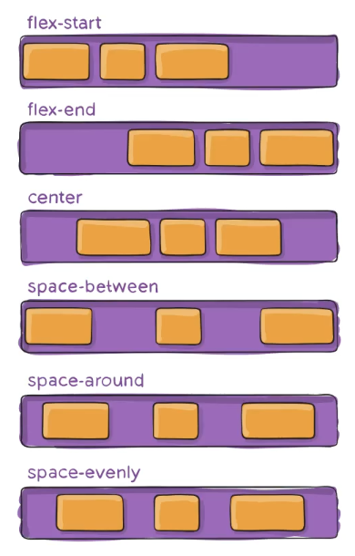
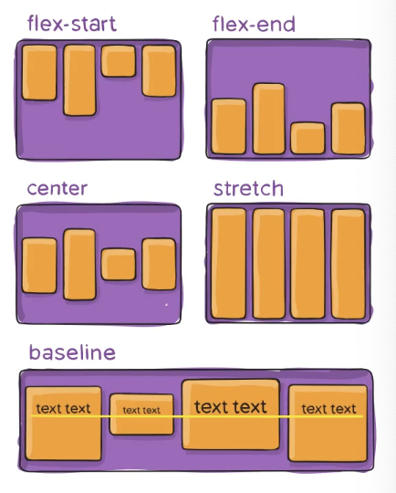
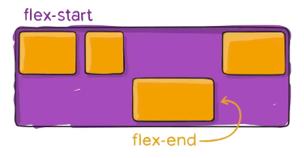

# HTML

## Sematanic Tags

在 HTML5 之後新增了許多語意化標籤，這些標籤可以讓瀏覽器更好的解讀網頁內容，也可以讓搜尋引擎更好的解讀網頁內容，讓網頁更容易被搜尋引擎搜尋到。

> Sematanic elements = elements with meaning

常用的幾個：
- `<header>`
- `<nav>`
- `<main>`

## 響應式網頁設計

Responsive Web Design，簡稱 RWD，是一種網頁設計方法，可以讓網頁在不同的裝置上都能有良好的使用體驗。

目前主流設計原則：
- Flexbox 自動排版，不用再用 float 來排版
- 元素、圖片等等都可以用 % （相對單位）來設定大小，不用再用 px 來設定大小，防止跑版。

概念比喻：


### Flexbox

讓容器可以用最好的方式填充可用空間。

更多資訊可以參考 [CSS Tricks](https://css-tricks.com/snippets/css/a-guide-to-flexbox/)。

#### Properties for the Parent (flex container)

`display: flex`是一種 inner display type。

Recall:


``` css
div.container {
  display: flex;
}

div.container a {
  color: red;
  width: 100px;
}
```
一但設定 `display: flex`，只要是 `div.container` 的子元素，都會變成 flex item。

Flex container 可設定 display 的屬性：
- `flex-direction`：可以設定 flex item 的排列方向，預設是 `row`，也就是水平排列，可以設定為 `column`，也就是垂直排列。
  
  總共有四種排列方式：
    - `row`
    - `row-reverse`
    - `column`
    - `column-reverse`
- `flex-wrap`：可以設定 flex item 的換行方式，預設是 `nowrap`，也就是不換行，可以設定為 `wrap`，也就是換行。
  

  延伸：`flex-flow`：可以同時設定 `flex-direction` 和 `flex-wrap`。
  ``` css
  /*eg*/
  div.container {
      display: flex;
      flex-flow: row wrap;
  }
  ```

- `justify-content`：依照 `flex-direction` 方向，設定 flex item 的對齊方式，預設是 `flex-start`，也就是靠左對齊，可以設定為 `flex-end`，也就是靠右對齊，也可以設定為 `center`，也就是置中對齊，也可以設定為 `space-between`，也就是平均分配，也可以設定為 `space-around`，也就是平均分配，但是會在兩邊留出一半的空間。
  

  `justify-content` 可以設定的值：
    - `flex-start`
    - `flex-end`
    - `center`
    - `space-between`
    - `space-around`
    - `space-evenly`

- `align-items`：依照 `flex-direction` 方向，設定 flex item 的對齊方式，預設是 `stretch`，也就是拉伸，可以設定為 `flex-start`，也就是靠上對齊，也可以設定為 `flex-end`，也就是靠下對齊，也可以設定為 `center`，也就是置中對齊，也可以設定為 `baseline`，也就是對齊基準線。
  

  `align-items` 可以設定的值：
    - `stretch`
    - `flex-start`
    - `flex-end`
    - `center`
    - `baseline`
    - `first baseline`
    - `last baseline`

總體 flex container 的設定範例：
``` css
/*eg*/
div.container {
    display: flex;
    flex-direction: row-reverse;
    flex-wrap: wrap;
    justify-content: space-around;
    align-items: center;
}
```

#### Properties for the Children (flex items)

剩餘空間（remaining space）是指 flex container 的寬度或高度，扣除所有 flex item 的寬度或高度，所剩下的部分。

常見的 flex item 屬性：
- `flex-grow`：利用剩餘空間讓 flex item 的放大比例，**剩餘空間會依照 `flex-grow` 的比例來分配**，如果沒有設定 `flex-grow`，則會依照 `flex-basis` 的大小來分配。預設是 0，設定值範圍 `[0, infinity)`。

- `flex-shrink`：設定 flex item 的縮小比例，預設是 1，也就是可以縮小，設定值範圍 `[0, infinity)`。如果沒有設定 `flex-shrink`，則會依照 `flex-basis` 的大小來縮小。

- `flex-basis`：設定 flex item 的初始大小，根據 `flex-direction` 決定設定是 `row` 或是 `column` 方向。，預設是 `auto`，也可以設定為 `0`，也就是不會佔用空間，也可以設定為 `px`，也就是固定大小，也可以設定為 `%`，也就是相對大小。

  如果沒有設定 `flex-grow` 和 `flex-shrink`，則會依照 `flex-basis` 的大小來分配剩餘空間。

其他： `flex`：可以同時設定 `flex-grow`、`flex-shrink` 和 `flex-basis`。
  ``` css
  /*eg*/
  div.item {
      flex: 1 1 0;
  }
  ```

- `align-self`：允許單個 flex item 覆寫默認對齊方式。設定 flex item 的對齊方式，預設是 `auto`，也就是繼承 `align-items` 的設定。
  
  ``` css
  /*eg 這個item就會獨自依照 flex-direction 的方向向中間對齊*/
  div.item {
      align-self: center;
  }
  ```

  `align-self` 可以設定的值：
    - `auto`
    - `stretch`
    - `flex-start`
    - `flex-end`
    - `center`
    - `baseline`
    - `first baseline`
    - `last baseline`


