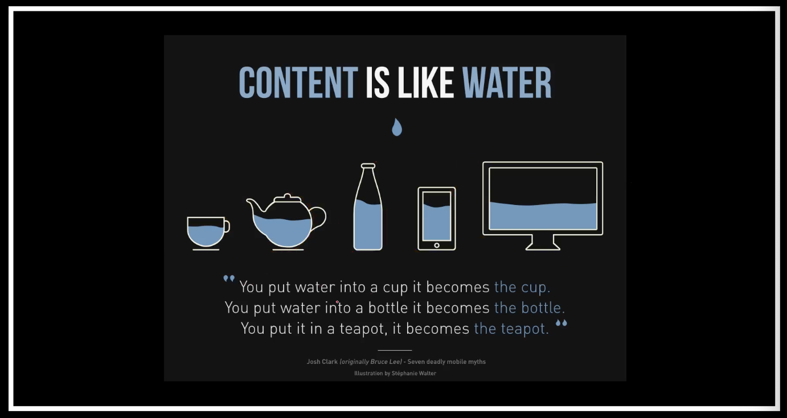
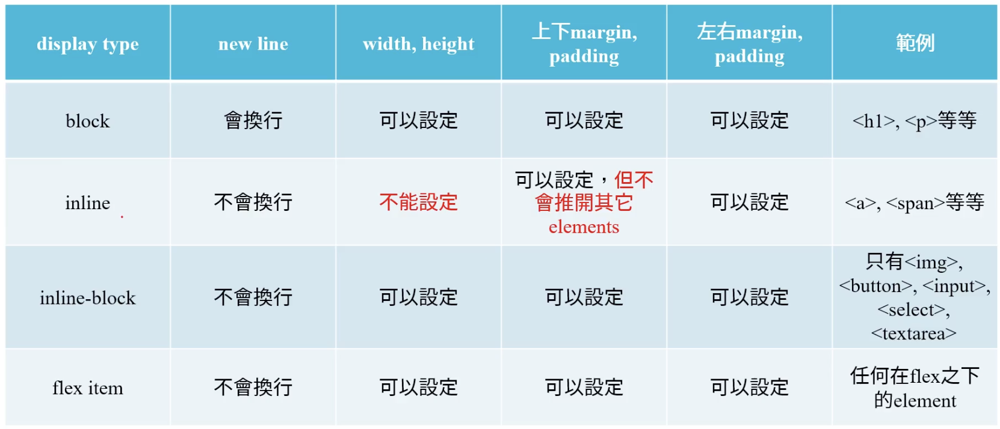
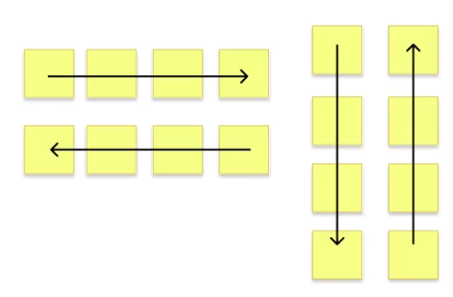
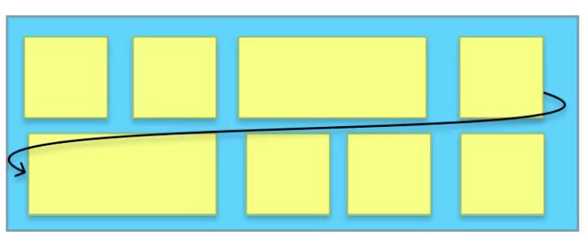

# HTML

## Sematanic Tags

在 HTML5 之後新增了許多語意化標籤，這些標籤可以讓瀏覽器更好的解讀網頁內容，也可以讓搜尋引擎更好的解讀網頁內容，讓網頁更容易被搜尋引擎搜尋到。

> Sematanic elements = elements with meaning

常用的幾個：
- `<header>`
- `<nav>`
- `<main>`

## 響應式網頁設計

Responsive Web Design，簡稱 RWD，是一種網頁設計方法，可以讓網頁在不同的裝置上都能有良好的使用體驗。

目前主流設計原則：
- Flexbox 自動排版，不用再用 float 來排版
- 元素、圖片等等都可以用 % （相對單位）來設定大小，不用再用 px 來設定大小，防止跑版。

概念比喻：


### Flexbox

讓容器可以用最好的方式填充可用空間。

更多資訊可以參考 [CSS Tricks](https://css-tricks.com/snippets/css/a-guide-to-flexbox/)。

#### Properties for the Parent (flex container)

`display: flex`是一種 inner display type。

Recall:



``` css
div.container {
  display: flex;
}

div.container a {
  color: red;
  width: 100px;
}
```
一但設定 `display: flex`，只要是 `div.container` 的子元素，都會變成 flex item。

Flex container 可設定 display 的屬性：
- `flex-direction`：可以設定 flex item 的排列方向，預設是 `row`，也就是水平排列，可以設定為 `column`，也就是垂直排列。
  
  總共有四種排列方式：
    - `row`
    - `row-reverse`
    - `column`
    - `column-reverse`
- `flex-wrap`：可以設定 flex item 的換行方式，預設是 `nowrap`，也就是不換行，可以設定為 `wrap`，也就是換行。
  
- `flex-flow`：可以同時設定 `flex-direction` 和 `flex-wrap`。
  ``` css
  /*eg*/
  div.container {
      display: flex;
      flex-flow: row wrap;
  }
  ```
- `justify-content`

``` css
/*eg*/
div.container {
    display: flex;
    flex-direction: row-reverse;
    flex-wrap: wrap;
    justify-content: space-around;
}
```


