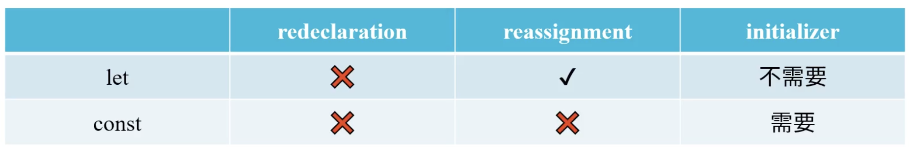

# Javascript

## 1.Basics

JavaScript是一種**腳本**，擁有自己的規範，稱為 ECMAScript(European Computer Manufacturers Association)；原本叫做 LiveScript，跟 Java 完全沒有關係。

Vanilla JavaScript 是指沒有使用任何額外的 library或框架的 JavaScript。常見的 library 有 jQuery(普遍度逐漸下降)、React、Vue.js、Angular 等等，越來越多網站使用純 JavaScript 來開發，因為這樣可以減少網頁的載入時間，並且可以避免使用到不必要的功能。

每個瀏覽器有自己的 JavaScript 引擎，例如 Chrome 的 V8、Firefox 的 SpiderMonkey、Safari 的 JavaScriptCore、Edge 的 Chakra 等等。若要確認瀏覽器的JavaScript引擎是否支援某種功能，可以參考 [Can I use](https://caniuse.com/)。

## 2.基本語法

### `<script>`通常放在哪？

通常會放在`<body>`的最後面，因為如果放在`<head>`裡面，瀏覽器會先讀取`<script>`，而`<script>`裡面的程式碼可能會需要讀取`<body>`裡面的元素，所以會造成錯誤。先讓瀏覽器加載HTML、CSS，再加載JavaScript，可以讓網頁更快顯示出來(提升使用者體驗)。

### 常見 JS 函數

- `console.log()`：在瀏覽器的開發者工具中，將 message 輸出到 Web 控制台，可以在 console 裡面看到輸出的結果。Message可以是任何資料型態，例如字串、數字、物件、陣列等 JavaScript Object。
    ```javascript
    console.log("Hello World!");
    ```

- `window.alert()`：在瀏覽器的畫面中，跳出一個對話框，顯示 message，並等待使用者按下確認按鈕後，才會繼續執行下面的程式碼。
    ```javascript
    window.alert("Hello World!");
    ```

- `window.prompt()`：在瀏覽器的畫面中，跳出一個對話框，顯示 message，並等待使用者輸入資料後，才會繼續執行下面的程式碼。
    ```javascript
    window.prompt("Please enter your name:");
    ```
## 3.Lexical Structure

好比自然語言有自己的語法規則，例如英文的句子要以大寫字母開頭，以句號結尾，中間要有主詞、動詞、受詞等等，JavaScript 也有自己的，稱為 Lexical Structure。幾個基本的規則如下：

- Case Sensitive：大小寫有別，`a`跟`A`是不同的變數。

- Whitespace：JavaScript 會忽略(minification)空白字元，例如空格、換行、縮排等等。

- 註解：單行註解以`//`開頭，多行註解以`/*`開頭，`*/`結尾。
    ```javascript
    // This is a single-line comment.
    /* This is a
    multi-line comment. */
    ```
- 變數名稱必須以字母、底線、美元符號開頭(數字不可)，後面可以接字母、數字、底線、美元符號。
    ```javascript
    var _name = "John";
    var $name = "John";
    var name = "John";
    ```

- Reserved Words：JavaScript 有一些保留字，不能用來當作變數名稱，例如 `var`、`let`、`const`、`function`、`return`、`if`、`else`、`for`、`while`、`switch`、`case`、`break`、`continue`、`true`、`false`、`null`、`undefined` 等等。

- Unicode：JavaScript 支援任何 Unicode 字元，例如中文字、日文字、韓文字等等。

- Semicolons：一行可以有多個敘述，以分號 `;` 分隔；也可以不用分號，但是不建議這樣做，因為會造成錯誤。
    ```javascript
    var x = 5; var y = 6; var z = x + y;
    ```

## 4.Variables and Assignment

所謂 變數 就是用來儲存資料的容器，資料可以是任何型態，例如字串、數字、物件、陣列等等，變數內的值可以不斷改變。在 JavaScript 中，變數的宣告方式有三種：`let`、`const`、`var`。

另外等號 `=` 是賦值運算子，用來將右邊的值賦予給左邊的變數。（JavaScript 支援 syntax sugar，可以使用 `+=`、`-=`、`*=`、`/=`、`%=` 等等，例如 `x += 5` 等同於 `x = x + 5`。）

### 在 JavaScript 中創造變數

三種宣告變數的方式：

- `let`：在 ES6 之後，`let` 是宣告變數的標準方式，它是 block scope，也就是說，變數的作用域只有在 block 內，如果在 block 外使用，會造成錯誤。
    ```javascript
    let x = 5;
    x = 6; // 可以改變
    console.log(x); // 6
    ```
    用 `let` 宣告變數時可以不用馬上給值(initialize)，但是在使用前必須要給值。還沒給值的變數，會有一個特殊的值 `undefined`。

- `const`：在 ES6 之後，`const` 是宣告常數的標準方式，它是 block scope，也就是說，常數的作用域只有在 block 內，如果在 block 外使用，會造成錯誤。**常數的值一旦設定，就不能再改變**。
    ```javascript
    const x = 5;
    x = 6; // 不能改變
    console.log(x); // 5
    ```
    用 `const` 宣告變數時必須要馬上給值(initialize)，否則會造成錯誤。

- （請勿使用）`var`：在 ES6 之前，`var` 是唯一的變數宣告方式，但是它有一些問題，例如變數可以重複宣告，而且它是 function scope，也就是說，變數的作用域只有在 function 內，如果在 function 外使用，會造成錯誤。
    ```javascript
    var x = 5;
    var x = 6; // 重複宣告
    console.log(x); // 6
    ```

特別注意：

- `const`，`let` 宣告過的變數不可以重複宣告。
- `const`不能重複賦值。

JavaScript 引擎中有 garbage collector，會自動回收不再使用的變數，所以不用擔心變數會佔用記憶體。


