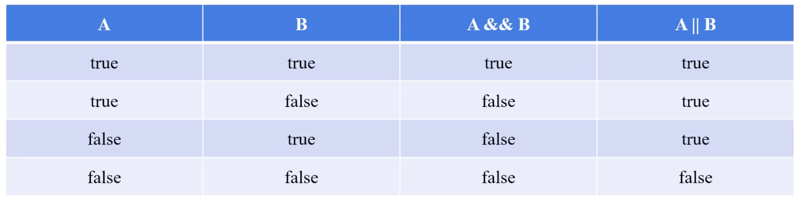
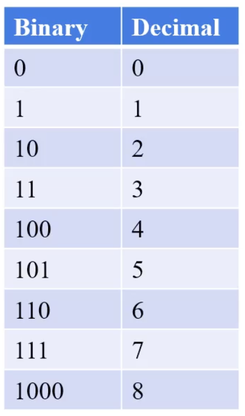
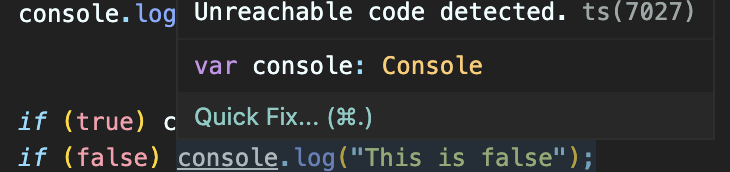
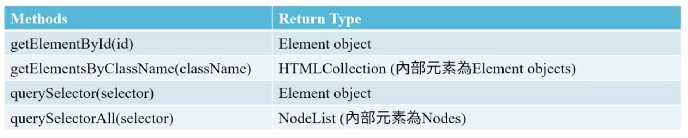
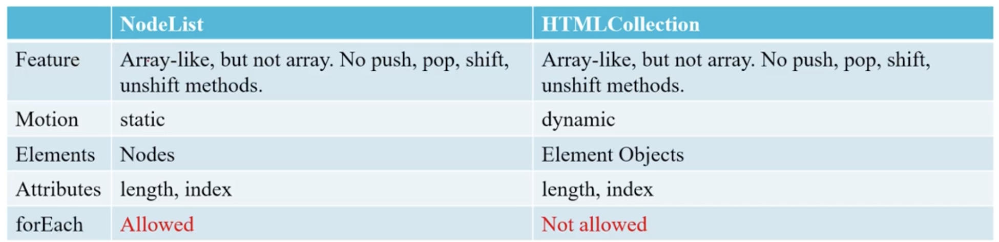

# Javascript

## 1.Basics

JavaScript是一種**腳本**，擁有自己的規範，稱為 ECMAScript(European Computer Manufacturers Association)；原本叫做 LiveScript，跟 Java 完全沒有關係。

Vanilla JavaScript 是指沒有使用任何額外的 library或框架的 JavaScript。常見的 library 有 jQuery(普遍度逐漸下降)、React、Vue.js、Angular 等等，越來越多網站使用純 JavaScript 來開發，因為這樣可以減少網頁的載入時間，並且可以避免使用到不必要的功能。

每個瀏覽器有自己的 JavaScript 引擎，例如 Chrome 的 V8、Firefox 的 SpiderMonkey、Safari 的 JavaScriptCore、Edge 的 Chakra 等等。若要確認瀏覽器的JavaScript引擎是否支援某種功能，可以參考 [Can I use](https://caniuse.com/)。

## 2.基本語法

### `<script>`通常放在哪？

通常會放在`<body>`的最後面，因為如果放在`<head>`裡面，瀏覽器會先讀取`<script>`，而`<script>`裡面的程式碼可能會需要讀取`<body>`裡面的元素，所以會造成錯誤。先讓瀏覽器加載HTML、CSS，再加載JavaScript，可以讓網頁更快顯示出來(提升使用者體驗)。

### 常見 JS 函數

- `console.log()`：在瀏覽器的開發者工具中，將 message 輸出到 Web 控制台，可以在 console 裡面看到輸出的結果。Message可以是任何資料型態，例如字串、數字、物件、陣列等 JavaScript Object。
    ```javascript
    console.log("Hello World!");
    ```

- `window.alert()`：在瀏覽器的畫面中，跳出一個對話框，顯示 message，並等待使用者按下確認按鈕後，才會繼續執行下面的程式碼。
    ```javascript
    window.alert("Hello World!");
    ```

- `window.prompt()`：在瀏覽器的畫面中，跳出一個對話框，顯示 message，並等待使用者輸入資料後，才會繼續執行下面的程式碼。
    ```javascript
    window.prompt("Please enter your name:");
    ```
## 3.Lexical Structure

好比自然語言有自己的語法規則，例如英文的句子要以大寫字母開頭，以句號結尾，中間要有主詞、動詞、受詞等等，JavaScript 也有自己的，稱為 Lexical Structure。幾個基本的規則如下：

### Case Sensitive

大小寫有別，`a`跟`A`是不同的變數。

### Whitespace

JavaScript 會忽略(minification)空白字元，例如空格、換行、縮排等等。

### 註解

單行註解以`//`開頭，多行註解以`/*`開頭，`*/`結尾。
```javascript
// This is a single-line comment.
/* This is a
multi-line comment. */
```
### 變數名稱

必須以字母、底線、美元符號開頭(數字不可)，後面可以接字母、數字、底線、美元符號。
```javascript
var _name = "John";
var $name = "John";
var name = "John";
```

### Reserved Words

JavaScript 有一些保留字，不能用來當作變數名稱，例如 `var`、`let`、`const`、`function`、`return`、`if`、`else`、`for`、`while`、`switch`、`case`、`break`、`continue`、`true`、`false`、`null`、`undefined` 等等。

### Unicode

JavaScript 支援任何 Unicode 字元，例如中文字、日文字、韓文字等等。

### Semicolons

一行可以有多個敘述，以分號 `;` 分隔；也可以不用分號，但是不建議這樣做，因為會造成錯誤。
```javascript
var x = 5; var y = 6; var z = x + y;
```

## 4.Variables and Assignment

所謂 變數 就是用來儲存資料的容器，資料可以是任何型態，例如字串、數字、物件、陣列等等，變數內的值可以不斷改變。在 JavaScript 中，變數的宣告方式有三種：`let`、`const`、`var`。

另外等號 `=` 是賦值運算子，用來將右邊的值賦予給左邊的變數。（JavaScript 支援 syntax sugar，可以使用 `+=`、`-=`、`*=`、`/=`、`%=` 等等，例如 `x += 5` 等同於 `x = x + 5`。）

### 在 JavaScript 中創造變數

三種宣告變數的方式：

#### `let`

在 ES6 之後，`let` 是宣告變數的標準方式，它是 block scope，也就是說，變數的作用域只有在 block 內，如果在 block 外使用，會造成錯誤。
```javascript
let x = 5;
x = 6; // 可以改變
console.log(x); // 6
```
用 `let` 宣告變數時可以不用馬上給值(initialize)，但是在使用前必須要給值。還沒給值的變數，會有一個特殊的值 `undefined`。

#### `const`

在 ES6 之後，`const` 是宣告常數的標準方式，它是 block scope，也就是說，常數的作用域只有在 block 內，如果在 block 外使用，會造成錯誤。**常數的值一旦設定，就不能再改變**。
```javascript
const x = 5;
x = 6; // 不能改變
console.log(x); // 5
```
用 `const` 宣告變數時必須要馬上給值(initialize)，否則會造成錯誤。

#### （請勿使用）`var`

在 ES6 之前，`var` 是唯一的變數宣告方式，但是它有一些問題，例如變數可以重複宣告，而且它是 function scope，也就是說，變數的作用域只有在 function 內，如果在 function 外使用，會造成錯誤。
```javascript
var x = 5;
var x = 6; // 重複宣告
console.log(x); // 6
```

### 特別注意

- `const`，`let` 宣告過的變數不可以重複宣告。
- `const`不能重複賦值。

JavaScript 引擎中有 garbage collector，會自動回收不再使用的變數，所以不用擔心變數會佔用記憶體。

## 5.Data Types and Values

### Types and Values

JavaScript 的幾種變數類型（7種 primitive data type）：
- Number: $2^{-253}$ ~ $2^{253}$，支援 加減乘除 基本運算，remainder operator（e.g. $x$ mod $y$），以及 `++`、`--`、`+=`、`-=`、`*=`、`/=` 等等。
    ``` javascript
    console.log(100 / 50); //2, 加減乘除
    console.log(100 % 50); //0, 餘數
    console.log(10 ** 2); //100, 次方

    /* x=x+1, x++, x+=1 */
    ```
- BigInt
- String：單引號、雙引號都可以通
    ```javascript
    let name = 'my name'; //單、雙引號都可以
    let sentence = "he's a person"; //混用時要注意，通常混用會在最外層使用雙引號,裏面則使用單引號
    console.log(name + sentence); //my namehe's a person, 文字可以使用 + 來進行串接(concatenation)，串接之間沒有空格；但文字不支援 -, *, /
    console.log(name + "\n" + sentence); //支援 \n 換行
    ```
    特殊狀況：
    ```javascript
    let n1 = 20;
    let n2 = 30;
    let name = "A";
    let n3 = 10;
    let n4 = 15;

    console.log(n1 + n2 + name); //50A, 由左向右運算
    console.log(n1 + n2 + name + n3 + n4); //50A1015
    ```
- Boolean
- null
- undefined
- Symbol
- *object：non-primitive data type，可能是 array、object、function

### Methods

### `Number` Methods

- `toString()`：將數字轉成文字
    ```javascript
    console.log(typeof n1.toString()); //string
    ```
- `toFixed(n)`：將數字四捨五入到n位數的**文字**
    ```javascript
    const n1 = 3.1415926;
    console.log(n1.toFixed(2)); //3.14
    ```
    二進制不能精確表示所有小數（floating point），會導致意外的情況如 `0.1 + 0.2 === 0.3` 會得到 `false`

### `String`'s Attributes & Methods

更多可以參考 [連結](https://developer.mozilla.org/zh-TW/docs/Web/JavaScript/Reference/Global_Objects/String)。

- `length`
    ```javascript
    let str = "ABCDE"
    console.log(str.length); //5
    ```
- `[n]`：從 0 開始的索引值
    ```javascript
    console.log(str[2]); //C
    console.log(str[10]); //undefined
    console.log(str[-1]); //undefined
    console.log(str[4]); //E
    console.log(str[str.length - 1]); //E, more practical usage
    ```
- `slice(indexStart[, indexEnd])`：substring，`indexStart` is inclusive(包含), `indexEnd` is exclusive(不包含).
    ```javascript
    console.log(str.slice(3)); //DE
    console.log(str.slice(1, 3)); //BC
    ```
- `indexOf(substring)`
    ```javascript
    console.log(str.indexOf("BCD")); //1, return matched index
    console.log(str.indexOf("BD")); //-1, if no match
    ```
- `toUpperCase()`、`toLowerCase()`
    ```javascript
    console.log("abcd".toUpperCase()); //ABCD
    console.log("ABCD".toLowerCase()); //abcd
    ```
- `split(pattern)`：回傳分割結果，以 `array`
    ```javascript
    console.log(str.split("B")); //[ 'A', 'CDE' ]
    console.log("ABCDECABCDA".split("C", 3)); //[ 'AB', 'DE', 'AB' ], take 3 elements from result
    ```
- `startsWith(s)`、`endsWith(s)`
    ```javascript
    console.log(str.startsWith("AB")); //true
    console.log(str.endsWith("CD")); //false
    ```
- `includes(str)`
    ```javascript
    console.log(str.includes("AB")); //true
    console.log(str.endsWith("CB")); //false
    ```
- `charAt(n)`：給 index 回傳該索引位置的結果
    ```javascript
    console.log(str.charAt(2)); //C
    ```
- `charCodeAt(n)`：給 index 回傳該索引位置的 UTF-16 **十進制** 結果，返回一個 `0~65535` 之間的整數
    ```javascript
    console.log(str.charCodeAt(4)); //69
    ```

### `Boolean`

> `true` and `false`

(Unary operator) `!` 可以反轉 boolean 值。

### `Undefined`、`Null`

#### `undefined`

已經宣告變數，卻沒有賦予 initializer，就會出現 `undefined`。而 `undefined`同時也是 functions 的預設 return value。

#### `null`

用來代表某個故意不存在的值，意即在宣告變數後，刻意（暫時）不賦值，而使用 `null`。

## 6.Operators

常見的運算符號有：

### Assignment operator：`=`

### Comparison operator：比較且輸出 boolean
1. `==` operands are equal
2. `!=` operands are not equal
3. `===` operands are equal and the same data type
4. `!==` operands are not equal or not the same data type
5. `>`, `>=`
6. `<`, `<=`
```javascript
console.log(3 == "3"); //true
console.log(3 === "3"); //false
console.log(3 !== "3"); //true
```
### Logical operator
> 若 $p$ 則 $q$；若非 $q$ 則非 $p$。

- `&&` and
- `||` or

Logical Table:


#### More about logical operator

##### `&&`

- 如果 `&&` 左側是 `true`，則結果同右側運算
- 如果 `&&` 左側是 `false`，則結果同左側運算
```javascript
console.log(3 && 10); //10
console.log(100 && 0); //0
console.log(0 && 100); //0
```

##### `||`

- 如果 `&&` 左側可以是 `true`，則結果同左側運算；其他則同右側運算
``` javascript
console.log(6 || 100); //6
console.log(NaN || 100); //100
```

應用：使用在取得資訊時
```javascript
let data = "my data"
console.log(data || "default data"); //my data
```

### Typeof operator (unary)
### Negation operator (unary)：`!`
### increment operator (unary)：`x++`、`x--`
### Bitwise operator：

#### 進制

在 Decimal 系統中可用數字集合為 `{1,2,3,4,5,6,7,8,9,0}`；Binary 系統為 `{0,1}`。進制對照表：



進制之間的轉換，以二進制轉換十進制為例：

$decimal = d_0 \times 2^0 + d_1 \times 2^1 + ... + d_k \times 2^k,$
where the $n_{\text{th}}$ bit is $d_{n-1}$.

#### bitwise operators:

```javascript
let a = 10; //1010
let b = 9; //1001
console.log(a & b); //1000 -> 8
console.log(a | b); //1011 -> 11
console.log(a ^ b); //0011 -> 3
console.log(~a); //0101
console.log(a << b); //1010000000000 -> 5120
console.log(a >> b); //0 -> 0
```

- `a & b`：相對應位置都是`1`返回`1`
- `a | b`：相對應位置都是`0`返回`0`
- `a ^ b`(XOR, exclusive or)：相對應位置相同 return `0`
- `~a`：反轉每個位置裡的bits
- `a << b`：`a` 的bits往左移動 `b`個位置，被移出的bits直接捨棄
- `a >> b`：`a` 的bits往右移動 `b`個位置，被移出的bits直接捨棄

##### When to use?

- 編碼運算
- 資料傳出時、sockets programming, ports
- 資料加密、SHA函數
- 作業系統、CPU
- Finite State Machine
- Graphics：影像處理、人工智慧

### Arithmetic oeprator：`+`、`-`、`*`、`/`、`++`、`--`、`+=`、`-=`、`*=`、`/=`、`**`、`%`

## 7.If statement

``` javascript
if (true) console.log("This is true");
//This is true

if (false) {
    console.log("This is true");
} else {
    console.log("This is false");
}
//This is false

let age = 20;
if (age < 18) {
    console.log("You are too young");
} else if (age < 30) {
    console.log("You are young");
} else {
    console.log("You are old");
}
//You are young
```

若有**絕對**不會被執行的 statement，VScode 會以淡化作為提示(Unreachable code detected.)


```javascript
// easy example
let your_age = window.prompt("Please enter your age:");
age = Number(age)
if (your_age >= 0 && your_age < 12) {
    alert("Ticket price is $100.")
} else if (your_age >= 12 && your_age < 65) {
    alert("Ticket price is $250.")
} else if (your_age >= 65 && your_age < 120) {
    alert("Ticket price is $150.")
} else {
    alert("Invalid age.")
}
```

### Truthy and Falsy Values

每個值在 boolean context 之下都可以被視為是 `true` 或是 `false`。在 boolean context 之下，JavaScript 會自動幫每個值做 type coercion。

常見的 boolean context 有兩種：

- `if` statement
- logical operator

#### Truthly

```javascript
//boolean context example (truthy)
if ("statement here") { //直接被視為是 true
    console.log("statement here");
}
```

#### Falsy

- `false`
- `0`, `-0`, 0n(BitInt)
- `""`, `''`, ` `` ` 等所有 empty string
- null
- undefined
- NaN
除此之外都是 truthy values（也包括 `[]` empty array、`{}` empty object）。

```javascript
if ("") {
    console.log("statement here");
} else {
    console.log("statement empty");
}
//statement empty
```

## 8.Functions

認識數學函數：[Desmos Graphic Calculator](https://www.desmos.com/calculator)

> 重要想法：函數 **1 對多** 就不是一個函數

JavaScript 的 function 語法：
```javascript
function name([param[, param[, ... param]]]) {
    statement
}
```

若沒有 `return`，函數將返回 `undefined`（JavaScript 預設的返回值）。每個函數都是一個 object，代表每個 function 都有 instance properties 和 instance methods。在 `return` 之後的程式碼都不會被執行。

## 9.Array 陣列

要將用途或性質相近的 object 儲存在一起時，就可以使用 array。

Array 的語法： `[]`

Array 的幾個特性：
- 大小可調，且內含元素可以是不同資料類型
- 只能透過 **非負整數** 的索引值獲取元素；索引值從 0 開始
- 複製會連同 reference 一起複製

### Methods and Properties

#### Instance property
- `length`：陣列長度

#### Methods
- `push(element)`：將元素加到陣列的尾端
- `pop()`：將陣列最尾端的元素刪除，並且返回該元素
- `shift()`：將陣列最頭端的元素刪除，並且返回刪除的元素
- `unshift(element)`：將一個或是多個元素夾到陣列的開頭

```javascript
let arr1 = [1, 2, 3];
let arr2 = [1, 2, 3];

console.log(arr1.push(4)); //4
console.log(arr1); //[1, 2, 3, 4]

console.log(arr1.pop()); //4
console.log(arr1); //[1, 2, 3]
console.log(arr1.shift()); //1
console.log(arr1); //[2, 3]

arr1.unshift(5);
console.log(arr1); //[5, 2, 3]
```

### 時間複雜度 time complexity

用 big $O$ 來表示 （$O$），跟參數數量 $n$ 視為一個時間複雜度函數，例如 $O(n^k)$。通常會估計演算法的操作單元數量，並且假設每個單元的執行時間相同。

### 延伸閱讀：primitive data type v.s. reference data type

- primitive data: copy by value, 在電腦中，會將值複製一份存放在記憶體的另一個位址
- reference data: copy by reference, 在電腦中，僅會複製記憶體位址，因此都會指向同一個記憶體位址

會這樣設計的原因之一是節省記憶體，通常primitive類型的都相對較小，佔用的空間較少；另一個原因是會了符合 OOP（物件導向）的設計特性。

```javascript
//reference data type
let arr1 = [1, 2, 3];
let arr2 = [1, 2, 3];
console.log(arr1 == arr2); //false, 因為記憶體位址是不一樣的

let arr3 = arr1;
console.log(arr1 == arr3); //true, 因為記憶體位址是同一個
```

## 10.Object 物件

> Hashtable

每個 JavaScript 的物件都有 properties 和 屬於物件的 function 稱之為 methods。在物件當中要調用自己的屬性時，使用 `this` 來調用自己擁有的屬性。
```javascript
let person = {
    first_name: "XXXX",
    last_name: "YYYY",
    age: 20,
    is_married: false,
    spouse: null,

    sayHi() {
        console.log("Hello, " + this.first_name);
    },

    speak(words) {
        console.log(this.first_name + " says: " + words);
    }
};
```

### Math Object

Math 是內建的物件，常用的 static properties：
- `Math.PI`
- `Math.E`

常用的 static methods：
- `Math.pow(x, y)`：$x^y$
- `Math.random()`：$[0, 1)$
- `Math.sqrt(x)`：$\sqrt{x}$
- `Math.abs(x)`：$|x|$
- `Math.floor()`：$\lfloor x \rfloor$
- `Math.ceil()`：$\lceil x \rceil$

### Window Object

**Window object 代表目前程式碼正在運行的視窗**。常使用的 methods 如下：
- `window.alert()`: 彈窗訊息
- `window.addEventListener()`: 將**事件監聽器**附加到 window object
- `window.clearInterval()`: 將 `setInterval` 所重複執行的程式碼暫停
- `window.prompt()`: return 用戶在提示對話筐中輸入的文字，`string`
- `window.setInterval(handler, interval(ms))`: 設定一個重複執行的動作與其間隔時間（毫秒）
- `window.console`: return 一個 console object，經常使用的有 `log()`、`error()`
- `window.document`: return window 包含的文檔，也就是 HTML 文件
- `window.localStorage`: return 一個 local storage 物件
- `window.sessionStorage`: return 一個 session storage 物件

### Window Document Object

- `window.document.addEventListener()`：事件監聽
- `window.document.createElement(tagName)`：創造一個元素
- `window.document.getElementById(id)`：return 第一個 id 相符合的元素
- `window.document.getElementsByClassName(className)`：return 一個動態的 HTMLCollection，內部元素包含所有具有給定的 className 的元素（一個集合）
- `querySelector(selectors)`：return 第一個符合 特定選擇器 的元素，採用深度優先搜尋演算法
- `querySelectorAll(selectors)`：return 一個靜態 NodeList，與 指定選擇器 匹配的元素列表

  > 深度優先演算法：依序往端節點前進搜尋，到端點後折返繼續搜尋，直到找到為止（一個一個節點搜尋）
  > 寬度優先演算法：依照樹層依序往底層搜尋，直到找到為止（一層一層搜尋）

#### 動態 v.s. 靜態

> 都不是 array，array-like object，一樣可以用 index 索引元素

- `HTMLCollection`：會隨著 document 的變動而變化
- `NodeList`：必須得重新宣告，才會得到改變
    ```javascript
    let hellos = document.getElementsByClassName("hello");
    let helloss = document.querySelectorAll(".hello");
    console.log(hellos.length); //2
    console.log(helloss.length); //2

    let body = document.querySelector("body");
    let p = document.createElement("p");
    p.innerText = "new line: Hello";
    p.classList.add("hello");
    body.appendChild(p);

    console.log("after add new line");
    console.log(hellos.length); //3
    console.log(helloss.length); //2

    helloss = document.querySelectorAll(".hello");
    console.log(helloss.length); //3
    ```

## 11.Document Object Model, DOM

文件 (HTML) 物件模型提供一個文件（樹）的結構化表示法，定義讓程式可以存取並改變文件架構、風格和內容的方法。簡單來說，**DOM允許在 JavaScript 當中操作 HTML 元素**。DOM 提供文件可以用結構化表示的方式來呈現已擁有的屬性函式的節點與物件組成。

- Document 是一個 object(物件)，是 window object 的一個屬性
- Document 是指 HTML document
- 這個模型意味 **所有document內部的HTML元素都是object，每個HTML標籤都有其屬性與方法**

**Document Object Model**，加載到瀏覽器當中的樹狀表示。


Inside nesting structure:
- Parent Node (Parent element)
- Child Node (Child element)
這兩者可以互相嵌套，形成一個樹狀的結構。

### Node 節點

DOM 當中的每個點被稱為節點，分成三種：
- HTML節點元素 element nodes
- 文字節點 text nodes
- 註解節點 comment nodes
當要拿到某個 tag 底下的所有元素，DOM提供兩種節點集合：`HTMLCollection`及`NodeList`

#### 差別比較: childNode v.s. children

- childNode: element node是三種節點的其中一種，每個node都有childNode屬性，**return type 是 NodeList**，內部包含此節點在 DOM tree 底下的**第一層**之所有節點，包含 elements, text, comment
- children: 每個element node有children屬性，**return type 是 HTMLCollection**，裡面包含此節點在 DOM tree 底下之所有 element node

因此 element node 這種node可以同時使用 childNodes 和 children 屬性，但其他兩種 node只能使用 childNode。 

#### 差別比較: return type


#### 差別比較: `HTMLCollection`、`NodeList`



## 12.Loop 迴圈

常見的迴圈有：
- `for` loop：明確知道要迴圈幾次可使用
- `while` loop：無法明確知道次數時可使用；但必須要 **設定計數器** ，避免電腦無止盡的執行
- `do`-`while` loop

> `return` 可以讓迴圈停止

### Loop Structure
```javascript
for (initialization; condition; final expression) {
    statement
};

while (condition) {
    statement
};

do {
    statement
} while (condition);
```

```javascript
/* for-loop example */
for (let i = 0; i < 10; i++) {
    console.log(i);
};
// i 從 0 開始，在 i 小於 10 前，每次迴圈內的 statement 結束後，執行 final expression i++

/* while-loop example */
let i = 0;
while (i < 3) {
    console.log("while:" + i);
    i++;
};
// 在 condition 為真的情況下，持續執行 statement，直到 condition 不為真則跳出迴圈

/* do-while example */
i = 0;
do {
    console.log("do while:" + i);
    i++;
} while (i < 3);
// 先執行 statement，才檢查 condition
```
- `initialization`：循環開始之前的計數器變量說明
- `condition`：每次循環迭代之前要評估的表達式。若此表達式為真則執行 statement；反之則跳出這個迴圈
- `final expression`：每次迭代結束時要執行的動作

### Nested loop

> 巢狀結構，迴圈裡的迴圈

```javascript
for (let i = 0; i < 3; i++) {
    for (let j = 0; j < 3; j++) {
        console.log("i:" + i + ", j:" + j);
    }
};
```

### `break`、`continue`

- `break`：會終止包含 `break` 的迴圈
- `continue`：會終止當前的 statement，開始進行迴圈裡的下一次迭代

    ```javascript
    /* break */
    let counter = 0;
    for (let i = 0; i < 2; i++) {
        for (let j = 0; j < 2; j++) {
            if (i == j) {
                break;
            }
            counter++;
        }
    };
    console.log(counter); //1

    /* continue */
    let counter = 0;
    for (let i = 0; i < 2; i++) {
        for (let j = 0; j < 2; j++) {
            if (i == j) {
                continue;
            }
            counter++;
        }
    };
    console.log(counter); //2
    ```

### Loop with Array

```javascript
let arr1 = [1, 2, 3];
for (let i = 0; i < arr1.length; i++) {
    console.log((i + 1) +  " th position of array: " + arr1[i]);
};
```

# Appendix

## A.Coding Conventions and Resitrictions


### Conventions
1. 變數與函數的名稱全部**小寫**，若名稱由兩個以上單字組成，使用 camelCase 或是 underline `MyFunction` or `my_function`
2. Operators 周圍加上空白鍵 `a && b`
3. 用分號結束 statement `console.log("This is a statement.");`
4. Constants 使用全部大寫字 `const MYCONSTANT = 100;`
5. Class 一律大寫開頭 `MyClass`

### Resitrictions
1. 變數、函數名稱不可數字開頭
2. 變數、函數名稱不可包含 hyphen(-, dash)
3. 變數、函數名稱不可使用 reserved words(保留字)


